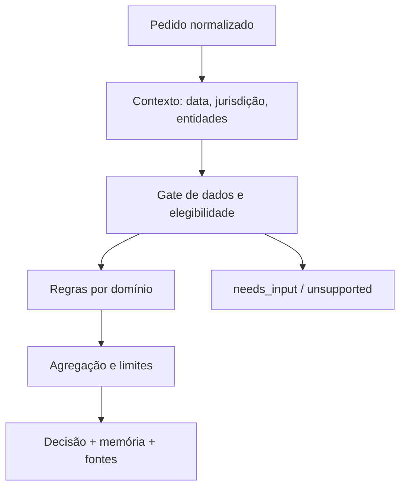

# Auditoria técnica e fiscal do ReciboCerto — Portugal 2026

**Versão auditada:** `704503a331952c0a1e74c411ded5e121fdf2d7c9` (`main`)
**Data de corte:** 22 de julho de 2026
**Jurisdição normativa:** República Portuguesa — Continente, Região Autónoma da Madeira e Região Autónoma dos Açores
**Âmbito:** código, dados fiscais, motores de cálculo, simuladores, fontes legais, testes, segurança, SEO, manutenção anual e desenho do `ReciboCerto-Fiscal-Engine`

> Este relatório avalia software informativo. Não certifica liquidações, não substitui a Autoridade Tributária e Aduaneira, a Segurança Social, um contabilista certificado, um advogado ou um notário.

---

## 1. Decisão executiva

O ReciboCerto evoluiu de forma significativa desde a auditoria de 18 de julho de 2026. A versão atual compila, gera 98 páginas estáticas, passa 125 testes, não apresenta vulnerabilidades conhecidas de nível elevado e contém uma base fiscal centralizada com origem e data de verificação. Foram acrescentados, entre outros, tabelas regionais de retenção, módulos de trabalho dependente, declaração guiada, heranças e uma API de dados fiscais.

Ainda assim, **os resultados dos simuladores não devem ser apresentados como um apuramento fiscal completo ou juridicamente determinado**. O problema principal deixou de ser a falta de números e passou a ser a ausência de um sistema formal de regras: elegibilidade, vigência, jurisdição, conflitos entre regimes, dados obrigatórios, proveniência legal verificável, memória de cálculo e estados seguros quando a resposta não pode ser determinada.

Há quatro bloqueios imediatos:

1. O motor anual de IRS aplica incorretamente o mínimo de existência e não calcula o adicional de solidariedade.
2. O simulador de empresa apresenta como "líquido do gerente" um valor que não desconta o IRS do salário.
3. A tributação autónoma de viaturas elétricas devolve 0% mesmo quando o custo de aquisição excede 62 500 €, situação em que a lei prevê 10% sobre os encargos.
4. Algumas referências legais abrem versões antigas ou diplomas errados, apesar de responderem HTTP 200. O monitor atual declara-as saudáveis porque não valida o conteúdo semântico.

### Classificação global

| Área | Estado | Decisão |
|---|---|---|
| Build, TypeScript e dependências | Verde | Base técnica utilizável |
| Dados centralizados e integridade aritmética | Amarelo | Boa fundação, controlo insuficiente |
| Tesouraria de recibos verdes | Amarelo | Útil como reserva estimada, não como obrigação final |
| IRS anual | Vermelho | Não usar como apuramento completo |
| IVA | Amarelo | Requer motor de enquadramento, períodos e território |
| Segurança Social | Amarelo | Requer ciclo trimestral, opções e condições de isenção |
| Trabalho dependente | Amarelo | Boa cobertura de retenção; falta separar retenção, acerto anual e casos laborais |
| Empresa / IRC | Vermelho | Resultado líquido materialmente incompleto |
| RFAI / SIFIDE / benefícios | Vermelho | Não calcular sem elegibilidade e documentação |
| Heranças e doações | Amarelo/Vermelho | Estimador limitado; partilhas complexas devem ser indeterminadas |
| Proveniência legal | Vermelho | Ligações sem validação semântica e fontes secundárias operativas |
| Atualização 2027+ | Amarelo | Existe monitor temporal, mas não há regras versionadas nem gestão de eventos legais |

**Recomendação:** congelar a expansão dos simuladores atuais, corrigir os P0 e migrar progressivamente as regras para o novo núcleo. A integração deve ocorrer por domínio e só depois de testes dourados revistos por profissional habilitado. Não publicar nem fazer deploy desta fundação antes desses gates.

---

## 2. Âmbito jurisdicional e rendimentos do Brasil

O produto é português. A residência fiscal, a incidência, as taxas, as deduções, as obrigações declarativas e o resultado final são determinados pela lei portuguesa.

Rendimentos provenientes do Brasil são um caso internacional de um contribuinte abrangido pelo sistema português; não transformam o motor num simulador brasileiro. O módulo deverá:

- determinar primeiro a residência e o período de residência em Portugal;
- classificar o rendimento segundo o CIRS e identificar o Anexo J;
- recolher montante bruto, moeda/data de conversão, imposto efetivamente pago no Brasil e natureza do rendimento;
- aplicar a [CDT Portugal–Brasil](https://diariodarepublica.pt/dr/detalhe/resolucao-assembleia-republica/33-2001-165237) e o [artigo 81.º do CIRS](https://info.portaldasfinancas.gov.pt/pt/informacao_fiscal/codigos_tributarios/cirs_rep/Pages/irs81.aspx);
- limitar o crédito de dupla tributação ao menor valor legal aplicável;
- devolver `needs_input` ou `unsupported` quando a residência, a natureza do rendimento, o imposto estrangeiro ou o artigo da convenção não forem determináveis.

Não devem ser importadas tabelas brasileiras para o cálculo do IRS português. A lei brasileira só é relevante para comprovar o imposto de fonte e interpretar a convenção, nunca para substituir CIRS, CIVA, CIRC ou Código Contributivo.

---

## 3. Método e evidência

### 3.1 Repositório e evolução

- Repositório: `henriquecoding/recibo-certo`.
- Ramo auditado: `main`.
- Commit anterior de referência: `e9deef2144c882478087c3f237c9481c049af56c`.
- Commit atual: `704503a331952c0a1e74c411ded5e121fdf2d7c9`.
- Diferença desde a auditoria anterior: 98 ficheiros alterados, 7 408 inserções e 3 628 remoções.

### 3.2 Comandos executados

| Verificação | Resultado em 22-07-2026 |
|---|---|
| `npm ci` | Passou após usar cache gravável do ambiente |
| `npm run build` | Passou; TypeScript e 98 páginas |
| `npx vitest run` | 9 ficheiros; 125/125 testes passaram |
| `npm audit --audit-level=high` | 0 vulnerabilidades |
| `npm run fiscal:check` | Passou com aviso de datas incoerentes |
| `npm run skills:check` | Passou |
| `npm run seo:audit` | Passou com 1 aviso: `/investidores` herda metadata |

### 3.3 Limite da evidência automatizada

Passar o build prova que o programa é compilável, não que uma liquidação é correta. Os testes existentes verificam sobretudo exemplos internos e invariantes; não foram encontrados testes dourados obtidos de liquidações oficiais ou validados por contabilista para mínimo de existência, adicional de solidariedade, IFICI, gerente, RFAI, SIFIDE ou TA de elétricos acima do limite.

O próprio `fiscal:check` expõe um problema de modelo: `DATA_LAST_REVIEW` é `2026-07-20`, mas `TODAY`, usado como `lastVerified` de muitos parâmetros, continua em `2026-06-11`. O comando avisa, mas termina com código 0. Portanto, "Estado: OK" não significa revisão integral e coerente.

---

## 4. O que está bem construído

Estas partes devem ser preservadas durante a migração:

1. `src/lib/fiscal-data.ts` centraliza os parâmetros e associa `legalBasis`, `source` e `lastVerified`.
2. `assertFiscalDataIntegrity()` impede vários estados aritmeticamente impossíveis.
3. Os escalões gerais de IRS de 2026 e as taxas gerais de IRC de 2026 estão representados.
4. A DLRR foi retirada dos cálculos correntes e marcada como revogada.
5. A distinção entre Continente, Madeira e Açores existe em tabelas de retenção e IVA.
6. O módulo de vencimento separa salário, subsídios, horas suplementares e alguns excessos sujeitos.
7. O módulo de heranças separa meação, partilha e Imposto do Selo e já devolve avisos em alguns casos incompletos.
8. A API `/api/fiscal-data` expõe dados, fontes e datas, criando uma base para observabilidade.
9. O projeto tem testes, CI, build estrito e uma disciplina interna explícita de verificação.
10. Os comentários distinguem várias vezes estimativa, retenção e imposto final; essa distinção deve passar a ser uma garantia de tipo e não apenas texto.

---

## 5. Inventário prioritário de falhas

### 5.1 P0 — bloquear integração/publicação

| ID | Classe | Componente | Falha | Impacto |
|---|---|---|---|---|
| P0-01 | Cálculo | `simularIRSAnual` | Mínimo de existência reduzido a um corte/clamp sobre rendimento coletável | IRS incorreto numa faixa sensível |
| P0-02 | Cálculo | `simularIRSAnual` | Adicional de solidariedade do art. 68.º-A ausente | Subestimação para rendimentos coletáveis > 80 000 € |
| P0-03 | Legal/cálculo | `simularIRSAnual` | IFICI a 20% aplicado ao coletável total, incluindo `outrosRendimentos` | Benefício indevido |
| P0-04 | Legal/cálculo | IRS Jovem | Um número de ano ativa o benefício sem idade, dependência, regularidade ou incompatibilidades | Benefício indevido |
| P0-05 | Cálculo | `ModoGuiadoEmpresa` | `liquidoGerente` não desconta IRS do salário | Sobreavaliação material do líquido |
| P0-06 | Cálculo | TA | Elétrico acima de 62 500 € continua com taxa 0% | Subestimação de TA |
| P0-07 | Legal | Fontes CIRC | URLs `circ_rep` abrem "versão até 2013" | Utilizador é enviado para taxas antigas |
| P0-08 | Legal | CFI/CSC/Portaria | Identificadores do Diário da República incorretos | Alegações sem suporte verificável |
| P0-09 | Legal/cálculo | RFAI/SIFIDE | Crédito aplicado a um montante introduzido, sem elegibilidade nem prova | Benefício potencialmente fictício |
| P0-10 | Arquitetura | Motor empresa | Lógica fiscal duplicada num componente com mais de 3 000 linhas | Divergência silenciosa entre superfícies |

### 5.2 P1 — corrigir antes da migração de cada domínio

| ID | Classe | Falha |
|---|---|---|
| P1-01 | Cálculo | Contabilidade organizada reduzida a `receita - despesas`, sem resultado contabilístico, correções fiscais, depreciações, perdas, TA e obrigações do regime |
| P1-02 | Legal | Redução dos coeficientes de início de atividade aplicada só pelo ano, sem testar rendimentos A/H nem cessação nos cinco anos anteriores |
| P1-03 | Cálculo | Contribuições obrigatórias para a regra dos 15% estimadas a partir do bruto em vez de recolhidas/apuradas |
| P1-04 | Cálculo | SS anual modelada linearmente, sem ciclo trimestral, opção ±25%, isenções condicionais e acumulação correta |
| P1-05 | Cálculo | Empresa assume que todo o lucro líquido é distribuível, sem reservas, aprovação, retenção e limitações societárias |
| P1-06 | Conteúdo | Frase "Todos os custos são dedutíveis" é falsa |
| P1-07 | Cálculo | Salário do gerente usa 12 meses e não modela retenção, subsídios, remuneração não regular nem enquadramento contributivo |
| P1-08 | Legal | PME/Small Mid Cap e benefícios ativados por localização, sem certificado/enquadramento |
| P1-09 | Legal | "Interior/litoral" é usado como substituto da região RFAI, que depende da classificação legal e do mapa de auxílios |
| P1-10 | Cálculo | Agravamento de TA diverge entre motores, especialmente despesas não documentadas |
| P1-11 | Cálculo | Declaração global não separa suficientemente rendimentos elegíveis para taxas especiais, englobamento, crédito externo e regimes incompatíveis |
| P1-12 | Arquitetura | API expõe snapshot sem `datasetId`, versão de esquema, hash, estado de aprovação ou período efetivo |
| P1-13 | Legal | Fontes secundárias são usadas como fonte operativa de números quando há texto oficial disponível |
| P1-14 | Testes | Não existem testes de equivalência entre calculadora, guiado, dashboard, comparador e API |

### 5.3 P2 — qualidade e produto

- Metadata própria em `/investidores`.
- Uniformizar avisos e grau de confiança na UI.
- Remover alegações absolutas como "verificado" quando apenas se verificou acessibilidade.
- Expor a memória de cálculo completa e exportável.
- Medir cobertura por regra legal, não apenas por linha de código.
- Acrescentar navegação acessível para erros e campos em falta.
- Distinguir valores mensais, trimestrais, anuais e por facto tributário em todas as etiquetas.

---

## 6. Auditoria por motor

## 6.1 Tesouraria por recibo verde

### Estado atual

`calcular()` estima valor recebido, retenção, IVA e uma reserva proporcional para Segurança Social. Resolve atividades através do pacote fiscal e contém exceções para clientes estrangeiros e regimes especiais.

### Problema de produto

Uma contribuição para a Segurança Social não nasce recibo a recibo. O rendimento relevante é apurado por período, declarado trimestralmente e convertido numa contribuição mensal, com condições e opções próprias. Mostrar uma parcela por recibo é útil como reserva de tesouraria, mas deve chamar-se `reservaSS`, nunca `ssDevida`.

### Implementação necessária

- saída separada: `cashReceived`, `vatCollected`, `withholding`, `recommendedReserve`;
- regra explícita de territorialidade do IVA e cliente B2B/B2C;
- validação da dispensa de retenção, início/cessação e entidade pagadora com contabilidade organizada;
- ligação do recibo a um período trimestral de SS;
- resultado `needs_input` para residência do cliente, qualidade do adquirente, localização do serviço ou enquadramento desconhecido;
- teste de equivalência entre emissão, dashboard, calculadora e declaração anual.

## 6.2 IRS anual

### Mínimo de existência

O código atual zera o imposto abaixo de 12 880 € e, acima disso, impede que o coletável após imposto desça de 12 880 €. O [artigo 70.º do CIRS](https://info.portaldasfinancas.gov.pt/pt/informacao_fiscal/codigos_tributarios/cirs_rep/Pages/irs70.aspx) usa rendimentos brutos, deduções específicas, despesas gerais, a taxa e o limite do primeiro escalão, uma função por troços e condições de exclusão considerando todos os titulares e rendimentos não englobados. O algoritmo atual não é uma aproximação conservadora; é uma fórmula diferente.

### Adicional de solidariedade

O [artigo 68.º-A do CIRS](https://info.portaldasfinancas.gov.pt/pt/informacao_fiscal/codigos_tributarios/cirs_rep/Pages/irs68a.aspx) acrescenta 2,5% entre 80 000 € e 250 000 € e 5% acima desse valor. Não foi encontrado no motor anual.

### IRS Jovem

O [artigo 12.º-B do CIRS](https://info.portaldasfinancas.gov.pt/pt/informacao_fiscal/codigos_tributarios/cirs_rep/Pages/irs12b.aspx) exige, entre outros elementos, idade até 35 anos, não ser dependente, opção, contagem dos anos com rendimentos, regularidade tributária e incompatibilidades. O input atual `irsJovemAno` é insuficiente e não pode gerar uma decisão `ok` sozinho.

### IFICI

O IFICI deve ser dividido em três decisões:

1. elegibilidade pessoal e temporal;
2. elegibilidade de cada atividade/entidade;
3. afetação da taxa de 20% apenas ao rendimento líquido A/B elegível.

O código aplica 20% a `rendimentoColetavelFinal`, onde podem estar `outrosRendimentos`. Isto pode abranger indevidamente capitais, rendas ou rendimentos não elegíveis. O motor deve preservar lotes de rendimento com origem, categoria, atividade, país e regime; não pode reduzir tudo prematuramente a um escalar.

### Regime simplificado e contabilidade organizada

O [artigo 31.º do CIRS](https://info.portaldasfinancas.gov.pt/pt/informacao_fiscal/codigos_tributarios/cirs_rep/Pages/irs31.aspx) impõe condições à redução dos coeficientes e detalha a regra de despesas. A versão atual desconhece rendimentos A/H, cessação anterior e valor efetivo das contribuições obrigatórias.

Contabilidade organizada não é `faturação - despesas`. A saída deve ficar `unsupported` até existirem resultado líquido contabilístico, correções fiscais, inventários/CMVMC, depreciações, imparidades, gastos não dedutíveis, TA, benefícios e restantes elementos relevantes.

### Rendimentos estrangeiros, incluindo Brasil

O motor atual aceita um crédito estrangeiro agregado. O modelo correto exige um lote por país, categoria e imposto de fonte. Para Brasil, deve citar a CDT e nunca assumir automaticamente que todo o imposto pago é creditável.

## 6.3 IVA

O limiar do [artigo 53.º do CIVA](https://info.portaldasfinancas.gov.pt/pt/informacao_fiscal/codigos_tributarios/civa_rep/Pages/artigo-53-o-do-civa.aspx) está representado, mas um motor de IVA precisa de muito mais do que `taxa` e `isento`:

- território e região;
- sujeito passivo e estabelecimento;
- B2B/B2C;
- localização da operação pelo artigo 6.º;
- inversão do sujeito passivo;
- transações intra-UE e número VIES;
- exportações/importações;
- data do facto gerador e exigibilidade;
- regime de caixa, periodicidade e direito à dedução;
- regularizações e pró-rata;
- regime transfronteiriço das pequenas empresas e limiar da União;
- transição quando o volume excede o limiar ou 25% adicional.

O resultado deve distinguir `enquadramento`, `taxa`, `liquidado`, `dedutível`, `a_entregar`, `obrigações` e `incertezas`.

## 6.4 Segurança Social de independentes

O cálculo linear `bruto × coeficiente × 21,4%` é uma reserva aproximada. O motor de obrigação precisa de:

- trimestres e meses contributivos;
- serviços, produção/venda, hotelaria e atividades excluídas;
- primeira declaração/início de efeitos;
- rendimento relevante e duodécimo;
- limites mínimo e máximo;
- opção de variação dentro dos limites legais;
- acumulação com trabalho dependente e respetivos limiares/condições;
- pensões, isenções, suspensão e cessação;
- dados efetivamente declarados e correções.

A [Segurança Social](https://www.seg-social.pt/ptss/pssd/menu/trabalho/remuneracoes-contribuicoes/trabalhadores-independentes) deve ser a fonte primária. Guias bancários ou blogues podem explicar, mas não autorizar parâmetros.

## 6.5 Trabalho dependente e recibo de vencimento

Esta é uma das áreas mais evoluídas do repositório: existem tabelas por região, situação familiar, deficiência, horas suplementares, subsídios e alguns excessos.

Lacunas materiais:

- o IRS Jovem continua a ser ativado sem o gate completo de elegibilidade;
- o excesso do subsídio de refeição ainda não é descontado no cálculo simples, apesar de estar identificado;
- a TSU e bases contributivas de prémios/ajudas requerem natureza, regularidade e prova;
- o custo da empresa não inclui todos os componentes em algumas funções;
- retenção mensal não deve ser apresentada como IRS anual;
- faltam cenários de part-time, mês incompleto, parentalidade/baixa, penhoras, remuneração em espécie, trabalhador não residente e taxas especiais;
- fontes das tabelas do Continente e de benefícios remuneratórios devem ser oficiais, não artigos de referência.

O motor deve produzir dois artefactos distintos: `PayrollWithholdingResult` e `AnnualIncomeTaxResult`.

## 6.6 Empresa, IRC e gerente

### Falha do líquido do gerente

O código calcula:

```text
salário líquido = salário bruto − 11% de Segurança Social
líquido do gerente = salário líquido + dividendos líquidos
```

Não subtrai retenção nem IRS anual do salário. Uma comparação empresa versus independente baseada neste total fica enviesada a favor da empresa.

### Lucro tributável

O motor parte de faturação menos custos introduzidos. Um apuramento de IRC precisa de separar:

- resultado contabilístico antes de imposto;
- variações patrimoniais;
- gastos não aceites e tributações autónomas;
- depreciações/amortizações fiscais;
- provisões, imparidades e inventários;
- prejuízos fiscais reportados;
- participação-exemption, rendimentos estrangeiros e retenções;
- benefícios fiscais e limites/cumulações;
- derrama municipal e estadual;
- pagamentos por conta, retenções e imposto a recuperar/pagar.

O [artigo 87.º do CIRC atual](https://info.portaldasfinancas.gov.pt/pt/informacao_fiscal/codigos_tributarios/CIRC_2R/Pages/irc87.aspx) deve substituir a ligação à versão até 2013.

### Custos dedutíveis

A frase "Todos os custos são dedutíveis ao lucro tributável" deve ser removida. A dedutibilidade depende de conexão empresarial, documentação e normas específicas; existem gastos não dedutíveis ou parcialmente aceites.

### Dividendos

Não se pode assumir distribuição de 100% do lucro pós-imposto. São necessários resultado distribuível, reservas, deliberação, participação, retenção, residência do beneficiário, opção de englobamento e eventual eliminação da dupla tributação económica.

## 6.7 Tributação autónoma

O [artigo 88.º do CIRC](https://info.portaldasfinancas.gov.pt/pt/informacao_fiscal/codigos_tributarios/CIRC_2R/Pages/irc88.aspx) confirma:

- viaturas: 8%, 25% e 32% pelos limiares atuais;
- PHEV elegível: 2,5%, 7,5% e 15%;
- elétricas acima do limite: 10% sobre encargos;
- representação: 10%;
- ajudas de custo elegíveis: 5%;
- despesas não documentadas: 50%;
- agravamento por prejuízo e exceção transitória de 2026 condicionada também ao cumprimento declarativo.

Falhas:

- `taxaTA("eletrica", custo)` ignora o custo e devolve sempre zero;
- o guiado não recolhe o custo da elétrica;
- as duas implementações divergem sobre o agravamento das despesas não documentadas;
- `lucroRecente` não recolhe o cumprimento das declarações dos dois períodos anteriores;
- faltam exceções de afetação, regime simplificado, viaturas excluídas e outras rubricas do artigo.

## 6.8 RFAI, SIFIDE, ICE e benefícios

Um crédito fiscal não pode resultar apenas de `montante × taxa`.

### RFAI

O motor deve verificar atividade elegível, CAE, região legal, tipo e novidade do ativo, data de entrada em funcionamento, criação/manutenção de postos de trabalho, intensidade de auxílio, dimensão da empresa, efeito de incentivo, cumulação, coleta disponível, reporte e dossiê documental. "Interior/litoral" não é um tipo suficiente.

### SIFIDE

A [Lei n.º 13/2026](https://diariodarepublica.pt/dr/detalhe/lei/13-2026-1086140529) autoriza a prorrogação até ao período de 2026 e a retirada do investimento indireto. Contudo, uma lei de autorização não deve ser tratada como se, por si só, implementasse toda a regulamentação operacional. O dataset deve guardar o ato habilitante, o ato executório e a data de efeitos.

São ainda necessários: despesas por categoria, elegibilidade da atividade de I&D, reconhecimento/idoneidade ANI, histórico de dois anos, exclusões, certificação, prazo de candidatura, coleta, reporte e fundos/veículos indiretos excluídos.

### ICE

Depende de aumentos líquidos de capitais próprios e histórico plurianual. Deve ficar `needs_input` sem balanços e movimentos elegíveis.

### Regra de segurança

Enquanto não houver gate de elegibilidade aprovado, estes módulos só podem devolver `potential_range` ou `needs_professional_review`; nunca "poupança" deduzida ao imposto final.

## 6.9 Heranças, doações e mais-valias

O motor melhorou a separação entre meação, partilha e Imposto do Selo. Porém, a partilha civil é demasiado sensível para transformar informação incompleta numa divisão definitiva.

Casos que devem resultar em `unsupported`/`needs_input`:

- testamentos com legados, substituições, fideicomissos ou inoficiosidades;
- repúdio, indignidade, colação e redução de liberalidades;
- vários netos dentro de cada estirpe;
- bens situados fora de Portugal;
- avaliação de participações, usufruto, nua propriedade ou empresas;
- dívidas contestadas e encargos não dedutíveis;
- regimes matrimoniais ou pactos atípicos;
- beneficiários não identificados.

O cálculo de mais-valias de imóvel herdado omite coeficiente de desvalorização monetária, despesas e encargos, reinvestimento, residência e várias exclusões. Deve ser rotulado como ilustração parcial até ser migrado.

---

## 7. Referências legais: ligações a corrigir

| Chave atual | Problema | Ligação correta/ação |
|---|---|---|
| `art87circ` | Abre CIRC "versão até 2013" | [CIRC atual — art. 87.º](https://info.portaldasfinancas.gov.pt/pt/informacao_fiscal/codigos_tributarios/CIRC_2R/Pages/irc87.aspx) |
| `art88circ` | Abre CIRC "versão até 2013" | [CIRC atual — art. 88.º](https://info.portaldasfinancas.gov.pt/pt/informacao_fiscal/codigos_tributarios/CIRC_2R/Pages/irc88.aspx) |
| `cfi` | ID do DR não corresponde ao consolidado correto | [Código Fiscal do Investimento](https://diariodarepublica.pt/dr/legislacao-consolidada/decreto-lei/2014-59423292) |
| `csc` | ID incorreto | [Código das Sociedades Comerciais](https://diariodarepublica.pt/dr/legislacao-consolidada/decreto-lei/1986-34443975) |
| `portaria208` | ID incorreto | [Portaria n.º 208/2017](https://diariodarepublica.pt/dr/detalhe/portaria/208-2017-107684448) |
| `despachoRetencao2026` | Artigo Montepio usado como referência da tabela | Substituir pelo despacho/PDF oficial da AT |
| `subsidioRefeicao2026` | Fonte comercial | Ligar ao diploma e norma fiscal oficiais |
| `occRFAI`, `occSIFIDE`, `occTA` | Fontes explicativas usadas em parâmetros operativos | Usar CFI/CIRC/atos 2026 como primárias; manter OCC como comentário |

### Nota desta sessão

As cinco primeiras linhas desta tabela (`art87circ`, `art88circ`, `cfi`, `csc`, `portaria208`) foram corrigidas em `src/lib/fiscal-data.ts` e no objeto `LEI` duplicado em `ModoGuiadoEmpresa.tsx`, com os IDs/URLs verificados diretamente (conteúdo da página, não só HTTP 200) nesta sessão. As restantes três linhas (fontes secundárias usadas como primárias) não foram alteradas.

### Porque o verificador atual falha

`scripts/check-fiscal-data.mjs --check-sources` apenas confirma que a resposta HTTP é bem-sucedida. Uma página de legislação antiga também responde 200. A verificação nova deve guardar e validar:

- autoridade e tipo de fonte;
- URL canónica e URL final após redirecionamento;
- título esperado e expressões obrigatórias;
- expressões proibidas, por exemplo "VERSÃO até 2013";
- artigo, diploma e data de publicação;
- `effectiveFrom` e `effectiveTo`;
- hash/fingerprint normalizado do excerto relevante;
- resultado de revisão humana e identidade do revisor;
- estado `active`, `superseded`, `pending`, `conflict` ou `withdrawn`.

*(A este propósito, ver `ReciboCerto-Fiscal-Engine/src/legal/validate.ts` — implementação inicial deste modelo de validação semântica, ainda não ligada ao `scripts/check-fiscal-data.mjs` do motor legado.)*

---

## 8. Causa estrutural

`Sourced<T>` responde "de onde veio este valor", mas não responde às perguntas de uma regra:

- a quem se aplica;
- em que período;
- em que território;
- quais condições têm de ser verdadeiras;
- que condições a excluem;
- que dados são obrigatórios;
- como arredondar;
- com que outras regras conflita;
- qual a fórmula e a sequência;
- que versão produziu o resultado;
- se a fonte foi semanticamente validada.

O código mistura cinco camadas:

1. parâmetros legais;
2. regras e elegibilidade;
3. orquestração do cálculo;
4. apresentação/explicação;
5. estimativas de produto.

No simulador de empresa, estas camadas vivem num componente React. No IRS, vários rendimentos são agregados antes de se decidir o regime de cada parcela. Por isso, adicionar mais campos não resolve o problema; aumenta a superfície de divergência.

---

## 9. Arquitetura proposta: `ReciboCerto-Fiscal-Engine`

O novo diretório criado com este relatório contém uma fundação executável e deliberadamente fechada por defeito. Não substitui ainda os motores de produção.

### 9.1 Princípios

1. **Portugal primeiro:** jurisdição explícita em todas as avaliações.
2. **Tempo como dado:** regra e parâmetro têm intervalo de vigência.
3. **Entidades explícitas:** pessoa, agregado/unidade fiscal, atividade, empresa, operação e ativo.
4. **Dinheiro em cêntimos:** sem `float` disperso e com política de arredondamento.
5. **Falhar fechado:** falta de dados gera `needs_input`; domínio não migrado gera `unsupported`.
6. **Proveniência transitiva:** cada valor de saída aponta para regras, parâmetros e fontes.
7. **Memória de cálculo:** fórmula, operandos, arredondamento e dependências.
8. **Dataset imutável:** um cálculo referencia `datasetId` e versão do motor.
9. **Sem lógica fiscal na UI:** componentes consomem contratos, não calculam impostos.
10. **Revisão humana:** dataset não aprovado não produz um resultado fiscal `ok` em modo normal.

Estes princípios seguem padrões de Rules as Code e de motores como o OpenFisca: parâmetros separados das fórmulas, valores datados, entidades, períodos e reformas não destrutivas. A [OCDE](https://www.oecd.org/en/publications/tax-administration-digitalisation-and-digital-transformation-initiatives_c076d776-en/full-report/component-10.html) destaca regras fiscais legíveis por máquina para reduzir erros e acelerar atualizações; a [documentação do OpenFisca](https://openfisca.org/doc/key-concepts/parameters.html) recomenda que números legais sejam parâmetros temporais e não constantes dentro de fórmulas.

### 9.2 Contrato de decisão

Toda a regra deve devolver exatamente um estado:

| Estado | Significado |
|---|---|
| `ok` | Dados suficientes, dataset aprovado e regra suportada |
| `needs_input` | Há campos identificados em falta |
| `not_applicable` | A regra foi avaliada e não se aplica |
| `unsupported` | O motor não cobre legalmente o caso |
| `conflict` | Há regimes/fontes/regras incompatíveis que exigem resolução |

"0 €" nunca pode representar "não sei".

### 9.3 Separação dos domínios



Domínios mínimos:

- `receipt-cashflow`;
- `personal-income-tax`;
- `vat`;
- `independent-social-security`;
- `payroll-withholding`;
- `corporate-income-tax`;
- `autonomous-taxation`;
- `tax-incentives`;
- `inheritance-and-gifts`;
- `international-income`.

### 9.4 Dataset anual

Cada dataset deve conter:

- `id`, `taxYear`, `schemaVersion`, `engineRange`;
- período efetivo e jurisdições;
- estado de revisão (`draft`, `reviewed`, `approved`, `retired`);
- lista de fontes e eventos legais;
- parâmetros com histórico, unidade e arredondamento;
- cobertura de regras e exceções conhecidas;
- hash e assinatura do pacote;
- revisores e data de aprovação;
- testes dourados esperados.

O dataset 2027 deve ser uma nova versão, não uma mutação do de 2026.

---

## 10. Estratégia de migração

### Fase 0 — contenção (P0)

- corrigir ligações legais;
- remover alegações absolutas;
- corrigir elétricos, mínimo de existência, solidariedade e líquido do gerente;
- desativar a dedução automática de RFAI/SIFIDE/RFAI contratual;
- acrescentar avisos visíveis nas superfícies afetadas;
- criar testes que falham antes da correção.

### Fase 1 — núcleo e proveniência

- adotar os contratos do novo diretório;
- criar catálogo oficial de fontes com validação semântica;
- versionar dataset e pedido/resultado;
- implementar dinheiro, percentagens e arredondamento;
- publicar apenas uma API interna experimental.

### Fase 2 — tesouraria, IVA e SS

- migrar primeiro a calculadora por recibo;
- separar reserva de obrigação;
- modelar períodos trimestrais e obrigações;
- introduzir matriz de territorialidade do IVA;
- executar testes cruzados com todas as superfícies.

### Fase 3 — trabalho dependente e IRS anual

- migrar lotes de rendimento por categoria;
- implementar deduções específicas, mínimo de existência por troços e solidariedade;
- gates completos de IRS Jovem e IFICI;
- englobamento e crédito internacional por lote;
- testar Continente/Madeira/Açores e tributação conjunta/separada.

### Fase 4 — empresa

- criar ponte para dados contabilísticos;
- separar IRC, derramas, TA e benefícios;
- modelar gerente com payroll real;
- determinar lucro distribuível e dividendos;
- retirar todas as fórmulas do componente React.

### Fase 5 — benefícios e sucessões

- implementar checklists legais e dossiês de prova;
- só calcular benefício quando todos os gates forem `true`;
- manter sucessões complexas fora do âmbito automático.

### Fase 6 — integração controlada

- execução paralela silenciosa do motor antigo e novo;
- comparação por cenário e telemetria sem dados pessoais;
- revisão das diferenças;
- ativação por feature flag e domínio;
- rollback imediato por dataset/versão.

---

## 11. Testes e gates de aceitação

### 11.1 Pirâmide obrigatória

1. **Unidade:** dinheiro, escalões, intervalos, arredondamento e seleção temporal.
2. **Regra:** uma regra por artigo/condição, incluindo limites exatos ±1 cêntimo.
3. **Cenários dourados:** exemplos revistos por contabilista e, quando possível, resultados oficiais anonimizados.
4. **Metamórficos:** mais rendimento não reduz imposto sem uma regra explícita; uma dedução nunca aumenta coleta; um regime não elegível não altera o resultado.
5. **Propriedades:** ausência de NaN/Infinity, valores monetários inteiros, soma da memória igual ao total.
6. **Cross-surface:** os mesmos inputs geram o mesmo `resultId` em UI, API e exportação.
7. **Legal links:** status, URL final, título, artigo, versão e expressões proibidas.
8. **Regressão anual:** 2026 permanece reprodutível após adicionar 2027.

### 11.2 Cenários P0 mínimos

- rendimento imediatamente abaixo/acima de cada limiar do mínimo de existência;
- coletável 79 999,99 €, 80 000 €, 80 000,01 €, 250 000 € e 250 000,01 €;
- IFICI com rendimento B elegível + dividendos + renda;
- IRS Jovem com idade 36, dependente, dívida fiscal, ano sem rendimento e antigo IFICI;
- elétrica de 62 500 € e 62 500,01 €;
- gerente com 12/14 meses, retenção, SS, dividendos e englobamento;
- RFAI com ativo não elegível e localização sem classificação;
- SIFIDE sem reconhecimento ANI ou histórico;
- rendimento brasileiro sem comprovativo de imposto e com moeda/data em falta;
- fonte CIRC antiga a responder 200 — o teste deve falhar pelo conteúdo.

### 11.3 Gate antes de produção

- 100% das regras P0/P1 com fonte primária ativa;
- 100% dos cenários dourados aprovados;
- 0 diferenças inexplicadas entre superfícies;
- 0 resultados `ok` com campos obrigatórios ausentes;
- build, TypeScript, lint/testes e `npm audit` limpos;
- revisão fiscal assinada para o dataset;
- revisão jurídica dos textos de responsabilidade e benefícios;
- plano de rollback testado;
- nenhuma publicação até autorização explícita.

---

## 12. Atualização 2026 → 2027

O processo não deve depender de alterar manualmente `TODAY` e pesquisar valores uma vez por ano.

### Calendário recomendado

| Momento | Ação |
|---|---|
| Permanente | Monitorizar DR, AT, Segurança Social, JORAM e JO Açores por evento legal |
| Proposta de OE | Abrir dataset `2027-draft`, sem o usar em produção |
| Lei do OE | Registar diploma, disposições transitórias e datas de efeito |
| Portarias/despachos | Completar retenções, IAS, RMMG e tabelas regionais |
| Janeiro | Executar cenários de fronteira e revisão humana |
| Antes de ativar | Aprovar dataset e publicar changelog de impacto |
| Após ativar | Preservar 2026 e monitorizar retificações/alterações intercalares |

Alterações durante o ano são reais; a atualidade não pode ser inferida só pelo ano fiscal. Cada evento legal deve gerar uma proposta de alteração, análise de impacto, testes e aprovação.

---

## 13. Brief de implementação para Claude Code/Codex

```text
Objetivo: migrar o ReciboCerto para um motor fiscal português versionado,
explicável e seguro, sem alterar o stack Next.js/TypeScript e sem publicar.

Ordem obrigatória:
1. Ler RELATORIO_AUDITORIA_RECIBO_CERTO_2026.md, CLAUDE.md e as skills fiscais,
   de arquitetura e verificação do repositório.
2. Fixar o commit de base e não misturar alterações não relacionadas.
3. Criar testes de reprodução para cada P0 antes de corrigir.
4. Usar apenas fontes oficiais portuguesas como origem normativa; fontes
   secundárias servem apenas de explicação.
5. Corrigir ligações CIRC/CFI/CSC/Portaria e implementar validação semântica.
6. Não devolver zero quando faltam dados. Usar ok, needs_input,
   not_applicable, unsupported ou conflict.
7. Manter dinheiro em cêntimos e registar política de arredondamento.
8. Não colocar lógica fiscal em componentes React.
9. Migrar um domínio de cada vez para ReciboCerto-Fiscal-Engine, mantendo um
   adaptador temporário e testes cross-surface.
10. Brasil só entra como país de fonte no módulo internacional, subordinado
    ao CIRS, artigo 81.º e CDT Portugal–Brasil.
11. Executar npm run build, npx vitest run, npm run fiscal:check,
    npm run seo:audit e npm audit --audit-level=high.
12. Não fazer commit, push, PR, deploy ou merge sem instrução expressa.

Definição de concluído por regra:
- input e entidade definidos;
- vigência e jurisdição definidas;
- pré-condições, exclusões e conflitos modelados;
- fórmula, unidade e arredondamento documentados;
- fonte primária semanticamente validada;
- memória de cálculo reproduzível;
- testes de fronteira, golden e cross-surface aprovados;
- revisão profissional registada.
```

---

## 14. Conclusão

O ReciboCerto já tem uma boa fundação de produto e engenharia, mas o próximo salto não virá de acrescentar mais taxas e toggles. Virá de converter legislação portuguesa em regras temporais, jurisdicionais, explicáveis e testáveis, com a capacidade explícita de dizer "faltam dados".

O `ReciboCerto-Fiscal-Engine` que acompanha este relatório estabelece esse contrato e impede, por defeito, que um dataset não aprovado produza uma resposta fiscal definitiva. A prioridade seguinte é corrigir os P0 no motor atual e migrar verticalmente, começando por recibos/IVA/SS e só depois IRS e empresa.

Nenhuma integração ou publicação foi efetuada nesta auditoria.

---

## Apêndice A — fontes primárias principais

- [Lei do Orçamento do Estado para 2026 — Lei n.º 73-A/2025](https://diariodarepublica.pt/dr/detalhe/lei/73-a-2025-993270096)
- [CIRS — artigo 12.º-B, IRS Jovem](https://info.portaldasfinancas.gov.pt/pt/informacao_fiscal/codigos_tributarios/cirs_rep/Pages/irs12b.aspx)
- [CIRS — artigo 31.º, regime simplificado](https://info.portaldasfinancas.gov.pt/pt/informacao_fiscal/codigos_tributarios/cirs_rep/Pages/irs31.aspx)
- [CIRS — artigo 68.º, taxas gerais](https://info.portaldasfinancas.gov.pt/pt/informacao_fiscal/codigos_tributarios/cirs_rep/Pages/irs68.aspx)
- [CIRS — artigo 68.º-A, adicional de solidariedade](https://info.portaldasfinancas.gov.pt/pt/informacao_fiscal/codigos_tributarios/cirs_rep/Pages/irs68a.aspx)
- [CIRS — artigo 70.º, mínimo de existência](https://info.portaldasfinancas.gov.pt/pt/informacao_fiscal/codigos_tributarios/cirs_rep/Pages/irs70.aspx)
- [CIRS — artigo 81.º, dupla tributação internacional](https://info.portaldasfinancas.gov.pt/pt/informacao_fiscal/codigos_tributarios/cirs_rep/Pages/irs81.aspx)
- [CIVA — artigo 53.º](https://info.portaldasfinancas.gov.pt/pt/informacao_fiscal/codigos_tributarios/civa_rep/Pages/artigo-53-o-do-civa.aspx)
- [CIRC — artigo 87.º atual](https://info.portaldasfinancas.gov.pt/pt/informacao_fiscal/codigos_tributarios/CIRC_2R/Pages/irc87.aspx)
- [CIRC — artigo 88.º atual](https://info.portaldasfinancas.gov.pt/pt/informacao_fiscal/codigos_tributarios/CIRC_2R/Pages/irc88.aspx)
- [EBF — artigo 58.º-A, IFICI](https://info.portaldasfinancas.gov.pt/pt/informacao_fiscal/codigos_tributarios/bf_rep/Pages/EBF58A.aspx)
- [Código Fiscal do Investimento](https://diariodarepublica.pt/dr/legislacao-consolidada/decreto-lei/2014-59423292)
- [Lei n.º 13/2026 — autorização SIFIDE II](https://diariodarepublica.pt/dr/detalhe/lei/13-2026-1086140529)
- [Código das Sociedades Comerciais](https://diariodarepublica.pt/dr/legislacao-consolidada/decreto-lei/1986-34443975)
- [Segurança Social — trabalhadores independentes](https://www.seg-social.pt/ptss/pssd/menu/trabalho/remuneracoes-contribuicoes/trabalhadores-independentes)
- [AT — rendimentos obtidos no estrangeiro](https://info.portaldasfinancas.gov.pt/pt/apoio_contribuinte/IRS/Pages/Rendimentos_estrangeiro.aspx)
- [CDT Portugal–Brasil](https://diariodarepublica.pt/dr/detalhe/resolucao-assembleia-republica/33-2001-165237)

## Apêndice B — significado das prioridades

| Prioridade | Critério |
|---|---|
| P0 | Pode produzir imposto/líquido materialmente errado, benefício indevido ou suporte legal falso |
| P1 | Pode falhar em casos comuns, divergir entre superfícies ou impedir manutenção segura |
| P2 | Qualidade, clareza, acessibilidade, observabilidade ou cobertura complementar |
