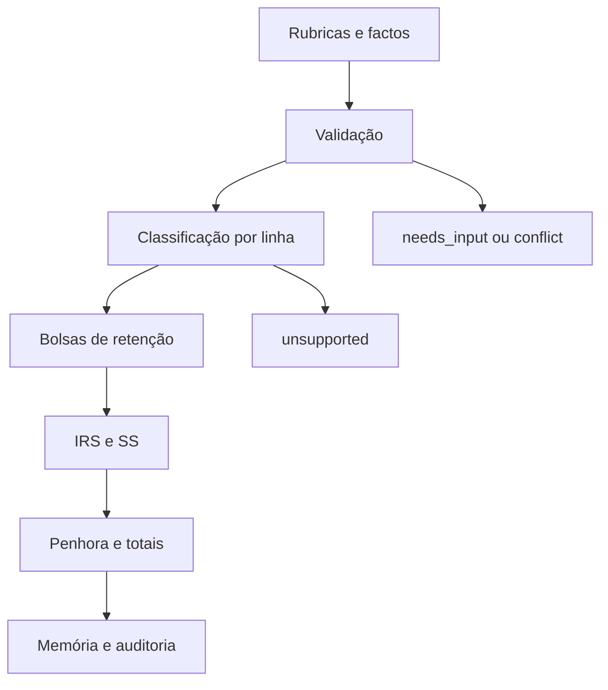

# 01 — Arquitetura do motor fiscal

## Componentes

- `core/`: dinheiro em cêntimos, taxas em ppm, decisões e executor temporal.
- `datasets/`: parâmetros anuais, jurisdição, estado e aprovação.
- `domains/payroll/types.ts`: contrato discriminado das rubricas.
- `engine.ts`: classificação e agregação linha a linha.
- `policy-2026.ts`: parâmetros estruturais revistos de 2026.
- `rule.ts`: integração com o `FiscalRuleEngine`.
- `src/lib/payroll-engine-adapter.ts`: ponte temporária para tabelas regionais legadas.

## Fluxo



## Invariantes

1. O UI nunca contém a regra fiscal.
2. Dinheiro é `Money { cents }`; não se usa ponto flutuante como estado fiscal.
3. A rubrica guarda identidade estável e nunca é agregada antes da classificação.
4. Subsídios, suplementar e retroativos usam bolsas autónomas.
5. O resolvedor de retenção recebe base sujeita e base de referência separadas.
6. Uma fonte citada é identificada no catálogo e validada semanticamente.
7. Dataset `draft` não produz decisão pública `ok` sem a flag exclusiva de teste.

## Algoritmo

```text
validar contexto, IDs, montantes e factos
para cada rubrica:
  classificar caixa, IRS, SS, bolsa e fonte
  se faltar facto: needs_input
  se não houver matriz: unsupported
agregar cada bolsa legal
resolver retenção regional/versionada
alocar retenção às linhas sem perder o total
calcular SS, líquido, custo e penhora
emitir memória, avisos e versão
```

## Exceções e segurança

Diferenças negativas, deduções superiores à remuneração, horas que atravessam 100 horas anuais e identificadores duplicados são conflitos. Benefícios identificados apenas pelo nome não são classificados por analogia.

## Testes mínimos

- conservação: soma das linhas igual aos totais;
- monotonicidade local do cálculo inverso;
- fronteiras a um cêntimo e a uma centésima de hora;
- separação de bolsas;
- invariância da ordem das linhas;
- recusa de dataset não aprovado.

## Fontes

O desenho operacionaliza o [CIRS](https://info.portaldasfinancas.gov.pt/pt/informacao_fiscal/codigos_tributarios/cirs_rep/Pages/irs2.aspx), o [Código do Trabalho](https://diariodarepublica.pt/dr/legislacao-consolidada/lei/2009-34546475) e o [Código Contributivo](https://diariodarepublica.pt/dr/legislacao-consolidada/lei/2009-34514575).
