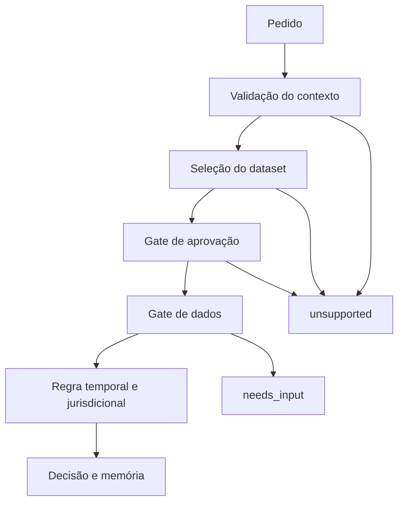

# Arquitetura e invariantes

## Invariantes de segurança

1. O contexto contém data, ano fiscal e jurisdição portuguesa explícitos.
2. Um dataset não aprovado é recusado em modo normal.
3. Uma regra só é selecionada dentro da sua vigência e jurisdição.
4. Campos em falta geram `needs_input`, nunca zero ou um valor por defeito.
5. Casos fora da cobertura geram `unsupported`.
6. Todos os montantes são inteiros em cêntimos.
7. Taxas são inteiros em partes por milhão (`ppm`).
8. Cada cálculo regista fórmula, operandos, política de arredondamento e citações.
9. Uma regra fiscal não vive num componente de UI.
10. O resultado guarda `engineVersion`, `datasetId`, `ruleId` e `evaluatedAt`.

## Fluxo

## Modelo temporal

Parâmetros e fórmulas são datados. Uma alteração de taxa cria um novo valor efetivo; uma alteração estrutural cria uma nova versão de regra. Adicionar 2027 não altera resultados de 2026.

## Aprovação

`draft` significa construção; `reviewed` significa revisão técnica concluída; `approved` significa revisão fiscal registada e cenários dourados aprovados; `retired` impede novas avaliações, mas preserva reprodutibilidade histórica.

O campo `allowUnapprovedDataset` só existe para desenvolvimento e testes. Não deve ser exposto pela aplicação pública.

## Migração

Os motores atuais continuam a funcionar até cada domínio cumprir:

- inputs completos e versionados;
- fontes oficiais semanticamente verificadas;
- fórmulas e arredondamento documentados;
- cenários de fronteira;
- testes dourados e cross-surface;
- revisão profissional;
- adaptador e rollback.

Não se faz uma migração "big bang".
