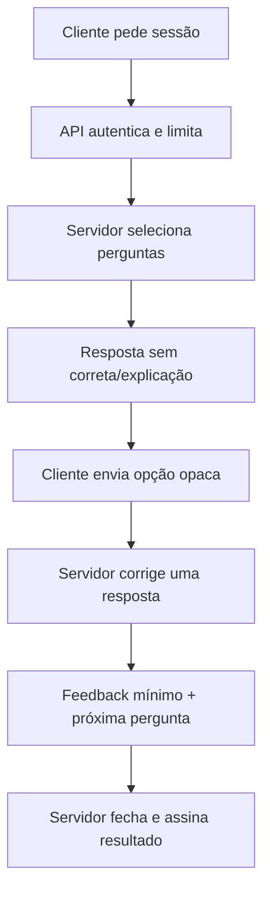

# Plano mestre de proteção dos ativos do ReciboCerto

**Estado:** proteção imediata implementada na branch
`agent/protecao-ativos-proprietarios`  
**Data:** 11 de agosto de 2026  
**Responsável:** @henriquecoding

## 1. Conclusão honesta

Não existe forma de tornar um site público literalmente inviolável. Um browser
tem de receber HTML, CSS, JavaScript, imagens e resultados para os apresentar;
uma pessoa que recebe esses bytes pode observá-los, fotografá-los ou reescrevê-los.
Robots, avisos legais, ofuscação e bloqueios de User-Agent não mudam este limite.

A proteção profissional combina quatro resultados mensuráveis:

1. o código-fonte e o histórico não ficam publicamente acessíveis;
2. segredos e lógica privilegiada nunca chegam ao browser;
3. extração automatizada cooperante é recusada e extração abusiva é limitada,
   registada e cara;
4. autoria, reserva de direitos e cadeia de prova ficam inequívocas para permitir
   reação jurídica e operacional.

Esta branch aplica as medidas que são seguras sem reescrever o produto. A
migração server-side abaixo é necessária para proteger de verdade o banco do
quiz e os motores que constituam segredo comercial.

## 2. Diagnóstico confirmado

| Superfície | Situação encontrada | Risco |
|---|---|---|
| GitHub | Repositório privado | Bom ponto de partida; colaboradores e tokens ainda precisam de mínimo privilégio |
| Licença | Não existia `LICENSE` | Um terceiro não recebia uma autorização open source, mas a intenção e os limites não estavam inequívocos |
| Crawlers | GPTBot, ClaudeBot, Google-Extended, Meta, Perplexity e outros estavam explicitamente autorizados | Conteúdo disponível para treino, grounding e indexação de IA |
| Quiz | O cliente importa o banco completo, incluindo `correta` | O bundle público permite reconstruir perguntas, respostas e explicações |
| Landing do quiz | Cada categoria publicava 20 respostas certas e explicações em HTML e JSON-LD | Extração em massa sem sequer jogar |
| Motores fiscais | Diversas fórmulas e tabelas executam no cliente | A lógica enviada ao browser é observável; muitos dados base são, contudo, lei e factos públicos |
| Source maps | Não havia declaração explícita | O padrão do Next já não os publica, mas uma regressão futura não era bloqueada |
| Módulos privilegiados | Vários ficheiros “server” liam segredos sem `server-only` | Um import errado poderia transportar uma fronteira privilegiada para Client Components |
| Ownership | Não existia CODEOWNERS | Mudanças críticas não tinham proprietário declarado |
| Regressões | Não existia teste da fronteira de exposição | Uma alteração futura podia desfazer silenciosamente todas as proteções |

## 3. Medidas aplicadas nesta branch

### 3.1 Repositório e cadeia de alterações

- `LICENSE` proprietária e `package.json#license = UNLICENSED`;
- aviso inequívoco no README;
- `SECURITY.md` com divulgação privada e regras de teste;
- CODEOWNERS para toda a árvore e reforço nas áreas críticas;
- template de PR com checklist de segredos, bundles, APIs e licenças;
- Dependabot para npm e GitHub Actions;
- workflow `Proteção de ativos` com permissões de leitura e Action fixada a
  commit completo;
- verificação local/CI `npm run security:boundary`.

### 3.2 Website, IA e prospeção de dados

- bloqueio total, no robots.txt, dos agentes declarados de IA, treino, datasets
  e scraping comercial;
- resposta HTTP 403 no Proxy para os mesmos User-Agents;
- Googlebot e Bingbot convencionais continuam a poder indexar título e URL;
- `max-snippet: 0`, `max-image-preview: none` e
  `max-video-preview: 0`: reduz a reutilização em Search e impede o conteúdo
  de ser input direto dos modos de IA da Pesquisa Google;
- `tdm-reservation: 1` em header HTTP e HTML;
- `/.well-known/tdmrep.json` com reserva para todo o origin;
- `X-Robots-Tag: noai, noimageai` como sinal suplementar;
- termos atualizados com reserva expressa para TDM, treino, RAG, embeddings,
  distilação, avaliação e bases derivadas;
- remoção das respostas e explicações em massa das páginas de categoria;
- amostra pública reduzida de 20 para 5 enunciados e remoção do Quiz JSON-LD.

**Impacto deliberado:** o ReciboCerto deixa de aparecer como fonte de conteúdo
nas pesquisas do ChatGPT, Claude e Perplexity que respeitem estes controlos.
No Google, títulos e URLs podem continuar indexados, mas sem snippet nem preview
de imagem. Isto protege conteúdo à custa de descoberta; não deve ser revertido
sem uma decisão explícita do titular.

### 3.3 Fronteiras técnicas

- `productionBrowserSourceMaps: false`;
- `poweredByHeader: false`;
- `frame-ancestors 'none'` e `X-Frame-Options: DENY`;
- `Cross-Origin-Resource-Policy: same-origin`;
- `X-Permitted-Cross-Domain-Policies: none`;
- HSTS alargado para dois anos e subdomínios;
- `server-only` em módulos de Supabase administrativo, Stripe, Lemon Squeezy,
  Resend, Twilio, cron, documentos, analytics, quiz e integração FIZ;
- CI reprova ficheiros de ambiente, chaves privadas, credenciais conhecidas,
  source maps públicos ou retirada das reservas de direitos.

## 4. Limites que permanecem

### 4.1 User-Agent não autentica ninguém

O Proxy bloqueia agentes honestos que se identificam. Um scraper malicioso pode
usar o User-Agent de um browser comum. A defesa contra isso é comportamento,
não nome: rate limit distribuído, sessão, desafio, autenticação, limites de
volume e deteção no CDN/WAF.

### 4.2 Minificação não protege propriedade intelectual

Desativar source maps reduz conveniência para quem copia, mas não transforma
JavaScript público em segredo. Ofuscação intensiva só aumenta bundle, dificulta
debugging e pode quebrar CSP; não é uma fronteira de segurança.

Não implementar:

- desativar botão direito;
- bloquear seleção ou copiar/colar;
- sobrepor conteúdo transparente;
- encriptar JavaScript com a chave entregue no mesmo browser;
- esconder fórmulas apenas por nomes curtos de variáveis.

Estas medidas prejudicam acessibilidade e utilizadores legítimos sem impedir
DevTools, requests HTTP, screenshots ou automação.

### 4.3 Factos fiscais não são exclusivos

Taxas, escalões, artigos e regras legais não pertencem ao ReciboCerto. O ativo
defensável é a seleção, validação, explicação, manutenção, arquitetura,
experiência, banco original e implementação. Um concorrente pode implementar
as mesmas leis de forma independente; não pode copiar a expressão protegida ou
a compilação do ReciboCerto.

## 5. P0 — retirar o banco do quiz do browser

### 5.1 Arquitetura alvo

Contrato recomendado:

1. `POST /api/quiz/sessoes`
   - recebe categoria, dificuldade e quantidade;
   - aplica rate limit por utilizador, IP e janela;
   - seleciona no servidor;
   - guarda IDs e permutação das opções numa tabela/armazenamento efémero;
   - devolve `sessaoId`, enunciados e opções com tokens opacos;
   - nunca devolve `correta`, mapa de índices, explicações antecipadas ou o
     banco completo.

2. `POST /api/quiz/sessoes/:id/respostas`
   - aceita uma única pergunta ainda aberta e um token de opção;
   - usa update condicional/versão para impedir replay e concorrência;
   - corrige no servidor;
   - só então devolve correto/errado, explicação daquela pergunta e fonte;
   - limita tentativas e tamanho do corpo.

3. `POST /api/quiz/sessoes/:id/fechar`
   - fecha uma vez;
   - calcula pontos, streak e prémios no servidor;
   - emite resultado assinado e idempotente;
   - não confia em acertos, tempo, dificuldade ou pontos enviados pelo cliente.

4. expiração curta
   - sessão expira;
   - estado é apagado segundo política de retenção;
   - não transportar o gabarito num JWT apenas assinado: JWT assinado é legível.
     Usar estado server-side ou envelope AEAD com chave exclusivamente no
     servidor.

### 5.2 Refatoração obrigatória

- separar `QuizPerguntaPrivada` de `QuizPerguntaPublica`;
- marcar o loader do banco com `server-only`;
- remover do hook cliente:
  - `carregarBancoQuiz`;
  - `embaralharOpcoes`;
  - `correta`;
  - `indicesOriginais`;
- eliminar imports dinâmicos de `perguntas-*.ts` no caminho cliente;
- obter explicação apenas depois da resposta;
- impedir endpoints de listagem, pesquisa ou exportação do banco;
- remover respostas completas de HTML, JSON-LD, RSC payloads e caches;
- proteger previews e deployments antigos que ainda contêm bundles históricos.

### 5.3 Provas de aceitação

O merge só está pronto quando:

- `rg "perguntas-parte|perguntas-iva|correta" .next/static` não encontra o
  banco nem um gabarito;
- uma string-canário de uma pergunta privada não aparece em nenhum JS público;
- respostas inventadas, repetidas, fora de ordem e concorrentes falham;
- a mesma sessão não gera prémio duas vezes;
- o modo normal, guiado, vantagens, acessibilidade e mobile passam os testes;
- o custo e a latência P95 do novo fluxo são medidos;
- os Termos e a Política de Privacidade refletem qualquer dado agora enviado ao
  servidor.

## 6. P0/P1 — motores fiscais

Classificar antes de migrar:

| Classe | Local recomendado | Motivo |
|---|---|---|
| Taxas e factos oficiais | Público/client quando útil | Não são exclusivos; transparência e verificabilidade geram confiança |
| Fórmulas triviais previstas na lei | Client ou server conforme privacidade | Escondê-las não cria exclusividade real |
| Orquestração, inferência, heurísticas e cenários originais | Server-only | Constituem implementação e know-how próprios |
| Relatórios premium, scoring e recomendações | Server-only + entitlement | Evita distribuição do motor e permite abuso controlado |
| Chaves, regras administrativas e anti-fraude | Server-only obrigatório | Fronteira de segurança |

Para cada motor server-side:

- esquema de entrada estrito e limite de bytes;
- recolha mínima de dados, sem logs de valores fiscais pessoais;
- autenticação/autorização e entitlements no servidor;
- rate limit distribuído e resposta idempotente;
- versão do motor, hash das regras e fontes na resposta;
- resultados necessários apenas, nunca tabelas internas completas;
- métricas de abuso sem PII;
- testes fiscais mantidos no repositório privado;
- avaliação de impacto RGPD antes de transferir cálculos hoje locais.

A migração integral de todos os simuladores para APIs sem esta avaliação seria
um retrocesso de privacidade e desempenho. O objetivo é proteger apenas o
know-how realmente exclusivo.

## 7. Definições manuais obrigatórias no GitHub

O conector de código não altera rulesets, colaboradores nem opções de segurança.
Depois do PR passar:

### 7.1 Ruleset de `main`

Em **Settings → Rules → Rulesets**, criar uma ruleset ativa para a default
branch:

- bloquear eliminações e force pushes;
- exigir pull request;
- exigir pelo menos uma aprovação;
- exigir aprovação de CODEOWNERS;
- dispensar aprovações antigas quando houver novos commits;
- exigir resolução de todas as conversas;
- exigir a check **Fronteira de segurança e propriedade**;
- exigir as checks de testes/build já existentes;
- impedir bypass, incluindo administradores, salvo conta de recuperação
  explicitamente auditada;
- considerar commits assinados se todos os bots e integrações usados forem
  compatíveis.

### 7.2 Acesso

- rever **Collaborators** e remover acessos inativos;
- cada pessoa usa conta própria, passkey/2FA e nunca token partilhado;
- conceder o menor papel possível e por tempo limitado;
- revogar tokens clássicos; preferir fine-grained PATs restritos a este repo;
- rever Deploy Keys e GitHub Apps instaladas;
- desativar Wikis, Discussions, Pages e forks se não forem usados;
- manter o repositório privado.

### 7.3 Segurança

- ativar Dependabot alerts e security updates;
- ativar Secret Scanning e Push Protection se o plano da conta suportar
  GitHub Secret Protection em repositório privado;
- se não suportar, acrescentar um scanner de segredos revisto e fixado por SHA
  no CI, e fazer uma auditoria offline completa do histórico;
- definir `GITHUB_TOKEN` como read-only por omissão;
- permitir apenas Actions selecionadas e exigir ações fixadas a SHA;
- impedir que workflows de PR não confiáveis recebam secrets.

## 8. Definições manuais obrigatórias na Vercel

- produção só a partir de `main` protegida;
- Deployment Protection para todos os previews;
- remover ou proteger deployments antigos que ainda sirvam bundles com o banco;
- variáveis secretas separadas por Production/Preview/Development;
- não disponibilizar `SUPABASE_SERVICE_ROLE_KEY`, chaves Stripe, Resend,
  Twilio, FIZ ou cifra a previews não confiáveis;
- acesso da equipa com mínimo privilégio e 2FA;
- rever integrações e tokens de deploy;
- configurar WAF/rate limit para rotas de quiz, documentos, pesquisa e APIs;
- validar o User-Agent no origin apenas como sinal, nunca como identidade;
- manter logs sem inputs fiscais, tokens ou dados pessoais.

## 9. Supabase e fornecedores

- RLS ativa em toda tabela acessível por chave pública;
- negar por omissão e testar policies com utilizadores diferentes;
- `service_role` apenas em código server-only;
- rodar imediatamente qualquer segredo encontrado em Git, logs ou preview;
- separar projetos/credenciais de produção e desenvolvimento;
- TTL e retenção explícitos para sessões de quiz, rate limits e eventos;
- webhooks com assinatura, anti-replay, idempotência e relógio tolerado;
- backups protegidos e restauração testada.

## 10. Proteção jurídica e prova

Solicitar revisão a advogado em Portugal antes de tratar os Termos como
aconselhamento jurídico final. Preparar:

- contratos de colaboradores com confidencialidade e cessão/licença adequada
  dos direitos patrimoniais;
- registo e proteção da marca/identidade visual onde fizer sentido;
- inventário de autores, datas, fontes e licenças de terceiros;
- releases assinadas, hashes e changelog imutável;
- prova datada dos designs, textos, bancos e versões dos motores;
- política de licenciamento para pedidos legítimos de TDM;
- procedimento para preservação de prova, notificação, takedown e ação judicial;
- pesquisa periódica de frases-canário e trechos originais em repositórios,
  sites e produtos concorrentes.

Não inserir perguntas falsas ou dados fiscais-canário. Para deteção de cópia,
usar marcas de proveniência que não alterem a exatidão jurídica ou o resultado.

## 11. Resposta a incidente

Se código, conteúdo ou credencial aparecer fora do controlo:

1. preservar URL, timestamp, headers, screenshots e hashes sem interagir
   destrutivamente com a cópia;
2. identificar se houve fuga de GitHub, deployment, bundle público ou insider;
3. revogar/rodar credenciais antes de limpar histórico;
4. fechar acesso, tokens e deployments afetados;
5. avaliar dados pessoais e obrigações RGPD;
6. enviar notificação/takedown com prova de titularidade;
7. corrigir a causa, não apenas a cópia visível;
8. documentar timeline e ações.

## 12. Fontes primárias

- [OpenAI — crawlers e separação entre GPTBot, OAI-SearchBot e ChatGPT-User](https://developers.openai.com/api/docs/bots)
- [Anthropic — bots e bloqueio por robots.txt](https://support.claude.com/en/articles/8896518-does-anthropic-crawl-data-from-the-web-and-how-can-site-owners-block-the-crawler)
- [Google — Google-Extended](https://developers.google.com/crawling/docs/crawlers-fetchers/google-common-crawlers)
- [Google — controlo de AI Overviews/AI Mode](https://developers.google.com/search/docs/appearance/ai-features)
- [Google — nosnippet e max-snippet](https://developers.google.com/search/docs/crawling-indexing/robots-meta-tag)
- [W3C Community Group — TDM Reservation Protocol](https://www.w3.org/community/reports/tdmrep/CG-FINAL-tdmrep-20240510/)
- [EUR-Lex — Diretiva (UE) 2019/790](https://eur-lex.europa.eu/eli/dir/2019/790/oj/eng)
- [GitHub — secret scanning](https://docs.github.com/code-security/secret-scanning/about-secret-scanning)
- [GitHub — push protection](https://docs.github.com/en/code-security/concepts/secret-security/push-protection)
- [GitHub — prevenção de fugas e branch protection](https://docs.github.com/code-security/tutorials/secure-your-organization/best-practices-for-preventing-data-leaks-in-your-organization)

## 13. Definition of Done global

A proteção só pode ser chamada de concluída quando:

- repositório, backups e previews têm acesso mínimo e auditado;
- ruleset e checks impedem merge inseguro;
- histórico foi analisado e segredos encontrados foram rodados;
- banco do quiz não aparece em bundles nem respostas em massa;
- motores exclusivos estão server-side;
- APIs resistem a scraping, replay e concorrência dentro dos limites definidos;
- deployments antigos expostos foram protegidos/removidos;
- termos foram revistos juridicamente;
- existem monitorização, evidência e procedimento de incidente;
- uma auditoria externa tenta reconstruir os ativos a partir do site público e
  documenta exatamente o que ainda é observável.
