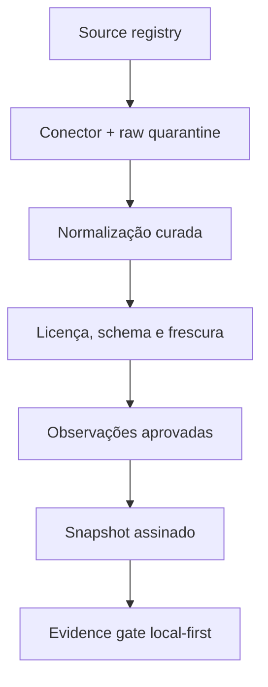

# Market Intelligence Engine

> Estado da implementação: **MI-2 — cobertura nacional, três pilotos com ingestão
> ativa e prova comercial local, em 2026-08-20**.
> Este documento é a especificação executável resumida. O handoff operacional
> vive em [`docs/handoff/MARKET-INTELLIGENCE-HANDOFF.md`](../handoff/MARKET-INTELLIGENCE-HANDOFF.md).

## 1. Resultado que o motor deve produzir

O catálogo de ideias contém hipóteses. O Market Intelligence Engine decide se
há evidência suficiente para as mostrar como oportunidades atuais em Portugal.
Não promete sucesso e não converte texto gerado por IA em factos.

Uma afirmação de mercado só pode entrar num resultado quando guarda:

- entidade publicadora e fonte registada;
- métrica e unidade explícitas;
- geografia e respetiva classificação;
- período de referência;
- data de publicação, quando existe;
- data real de recolha;
- validade para a finalidade concreta;
- transformação e versão do parser;
- estado de qualidade e mapeamento semântico;
- SHA-256 do conteúdo de origem.

Se estes elementos não forem demonstráveis, o estado correto é **dados
insuficientes**, nunca uma média, previsão ou “estimativa plausível” escondida.

## 2. Fronteiras que não se atravessam

| Responsabilidade | Fonte de verdade |
|---|---|
| impostos, Segurança Social, IVA e obrigações legais | motores fiscais existentes |
| preço, margem, horas faturáveis e capacidade económica da oferta | `src/lib/pricing` |
| agregação, estrutura, caixa e viabilidade do negócio | `src/lib/negocio` |
| procura, estrutura setorial, concorrência e proveniência externa | `src/lib/negocio/market` |
| perfil, localização exata e testes privados do utilizador | dispositivo do utilizador |

O módulo de mercado não contém um segundo solver de preço. O `evidence gate`
recebe `economicViability` do motor canónico e apenas decide se essa condição,
em conjunto com a evidência externa, permite subir o estado da hipótese.

## 3. Estados públicos

| Estado | Linguagem da interface | Condição resumida |
|---|---|---|
| `template` | Ideia possível | catálogo sem evidência utilizável |
| `signal_detected` | Sinal a investigar | pelo menos um sinal saudável |
| `candidate` | Candidata para teste | sinais independentes; economia ou operação por validar |
| `evidence_qualified` | Oportunidade sustentada por dados | gate completo atravessado |
| `user_validated` | Validada no seu mercado | orçamento aceite, pré-venda, piloto pago ou venda atual |
| `operating` | Negócio em operação | repetição, contribuição positiva e recebimento observados |
| `stale` | Precisa de nova validação | fonte crítica ou prova do utilizador perdeu validade |
| `contradicted` | Hipótese contrariada | requisito bloqueado, economia inviável ou contradição decisiva |

Um piloto pago isolado sobe para `user_validated`, não para `operating`.

## 4. Evidence gate mínimo

Para `evidence_qualified`, todas estas condições são obrigatórias:

1. sinal recente de procura ou transação;
2. segundo sinal de estrutura, transação, oferta, concorrência ou custo;
3. pelo menos duas fontes independentes e saudáveis;
4. geografia compatível com o modelo de entrega;
5. mapeamento semântico aprovado por curadoria;
6. nenhuma fonte crítica stale, em revisão de licença ou quarentena;
7. viabilidade económica confirmada na Pricing/Business Engine;
8. requisitos críticos conhecidos;
9. teste de falsificação definido.

O score de atratividade só será implementado depois deste gate. Um score alto
não pode compensar licença desconhecida, dado antigo, geografia errada ou um
preço economicamente inviável.

## 5. Quatro relógios diferentes

| Campo | Pergunta que responde |
|---|---|
| `referencePeriod` | a que período o valor diz respeito? |
| `publishedAt` | quando a entidade o publicou/reviu? |
| `retrievedAt` | quando o Recibo Certo o recolheu? |
| `validUntil` | até quando pode sustentar esta finalidade? |

`retrievedAt` nunca prolonga `referencePeriod`. Uma série de 2023 recolhida em
2026 continua a ser uma série de 2023.

## 6. Pipeline pretendida



O browser não deve consultar dez fornecedores quando alguém abre um cartão.
A ingestão ocorre no servidor, publica um pack público compacto e o cliente
combina esse pack localmente com o perfil privado.

## 7. Source registry atual

Estado revisto em 2026-08-20:

| Fonte | Acesso confirmado | Estado do conector | Estado de reutilização |
|---|---|---|---|
| [INE — API da Base de Dados](https://www.ine.pt/xportal/xmain?xpgid=ine_api_db&xpid=INE) | JSON por indicador | `ready` | `review_required` |
| [BPstat — Data API](https://bpstat.bportugal.pt/data/docs) | API JSON-stat | `planned` | `review_required` |
| [dados.gov.pt](https://dados.gov.pt/) | API/catálogo aberto | `planned` | catálogo aprovado; licença de cada recurso é separada |
| [Eurostat](https://ec.europa.eu/eurostat/web/user-guides/data-browser/api-data-access/api-getting-started) | JSON-stat | `ready` | `approved`, com atribuição e termos específicos por recurso |
| [IEFP](https://www.iefp.pt/estatisticas) | ODS mensal | `planned` | `review_required` |

### Porque o INE genérico ainda fica em quarentena

A documentação oficial confirma o endpoint e o acesso público. Nesta revisão
não foi encontrada, na própria documentação da API, uma licença inequívoca que
autorize armazenamento e republicação comercial de qualquer série. O conector
funciona, mas `validateMarketObservation()` bloqueia publicação até essa questão
ser resolvida e registada. O mesmo princípio aplica-se ao BPstat.

Datasets concretos publicados no dados.gov com licença CC BY 4.0 podem atravessar
o gate através de `datasetLicense`. Isto não aprova outras séries do INE. É uma
propriedade do produto: **acesso público não é sinónimo automático de direito de
republicação**.

## 8. Conectores

Implementação: `src/lib/negocio/market/connectors/ine.ts`.

O conector:

- constrói apenas URLs para o host e endpoint registados;
- aceita códigos de indicador com exatamente sete algarismos;
- usa `op=2`, língua explícita e `Accept: application/json`;
- valida o envelope antes de o usar;
- calcula SHA-256 da resposta, sem fallback para hash fraco;
- recebe `fetch` e relógio por injeção para testes determinísticos;
- normaliza apenas períodos anuais;
- exige unidade, métrica, validade, dimensões e geografias num manifesto curado;
- põe sinais convencionais, valores ambíguos, duplicados e mudanças de nome
  geográfico em quarentena.

O indicador `0000540` presente nos testes é uma fixture do schema oficial. Foi
escolhido porque a resposta pública contém períodos, geografias, dimensões,
valores e sinais convencionais. **Não é uma métrica de oportunidade e não entra
no produto.**

`connectors/eurostat.ts` valida o cubo JSON-stat pelas dimensões `id`/`size`,
percorre índices de forma determinística e só publica células selecionadas por
manifesto. O `independenceKey` pertence ao sinal: duas superfícies que derivam
da mesma operação estatística contam uma vez.

## 9. Integridade e source health

Uma observação só é publicável quando:

- a fonte existe no registry;
- a licença está `approved`;
- campos obrigatórios não estão vazios;
- números são finitos;
- datas ISO são inequívocas e o período é coerente;
- país, código e nome geográfico existem;
- completude pertence a `[0, 1]`;
- mapeamento semântico está `approved`;
- checksum usa SHA-256;
- a observação não expirou.

Estados operacionais reservados no contrato:

`healthy`, `delayed`, `stale`, `schema_changed`, `license_review`,
`quarantined` e `disabled`.

Não existe fallback numérico quando uma fonte falha.

## 10. Privacidade e segurança

- Perfil pessoal, localização precisa, entrevistas, orçamentos e vendas ficam
  locais por omissão.
- Snapshots públicos não contêm consultas individuais nem identificadores de
  utilizadores.
- APIs pagas/on-demand só serão chamadas por ação explícita e segundo os termos
  de cache/armazenamento.
- Não fazer scraping de Google Maps, Idealista, OLX, LinkedIn ou plataformas
  semelhantes.
- IA pode propor um mapeamento CAE/CPV/termo, mas não o aprova nem fornece o
  valor numérico.

## 11. Primeira interface pública

A rota `/ferramentas/descobrir-negocio` pode existir antes de haver uma
“oportunidade verde” porque mostra estados incompletos e o que falta. Um cartão
`evidence_qualified` continua bloqueado enquanto não existirem:

1. licença resolvida para as séries publicadas;
2. três fontes independentes úteis, sendo pelo menos duas oficiais ou
   transacionais licenciadas;
3. manifests de indicadores curados e versionados;
4. pipeline de ingestão com raw quarantine;
5. snapshot versionado, hash, assinatura e manifesto;
6. source health observável;
7. integração explícita com a Pricing Engine;
8. cartões com fonte, geografia, período, recolha e limitações visíveis.

Três pilotos consultam fontes oficiais no servidor: o turístico via INE (licença
CC BY do dataset) e os dois digitais via Eurostat. Os restantes ficam `template`;
nenhum recebe valores fictícios.

Nenhum piloto atinge `evidence_qualified` neste checkpoint, e isso é a leitura
correta: as duas séries digitais nascem do mesmo inquérito e partilham
`independenceKey`, pelo que contam por uma fonte. O cartão diz exatamente isso
em vez de fingir triangulação. Uma segunda operação estatística independente
por hipótese é trabalho de MI-3.

## 12. Verificação local

```bash
npm ci
npm run market:check
npx tsc --noEmit
npm test
npm run build
# com `npm start` noutro terminal:
npm run descobrir:e2e
```

O conjunto dedicado cobre source registry, integridade, frescura, lineage,
evidence gate, conectores INE/Eurostat, quarentena, snapshots, adapter de preço,
geografia, provas locais e o gate local.

`descobrir:e2e` cobre o que não cabe no vitest e onde os dois defeitos mais
caros de MI-1 viveram: o contexto nacional a desaparecer do ecrã e o preço
unitário no campo do recibo mensal. Nenhum dos dois partia build, testes ou
type-check. Corre em 360 px e desktop, claro e escuro, com axe.

## 13. Geografia: onde o modelo funciona ≠ onde temos dados

Confundir as duas coisas custou um defeito real em MI-1. O piloto turístico
declarava `regions: ["grande-lisboa", "peninsula-setubal"]` porque o manifesto
começou por mapear duas NUTS II — e a interface filtrava as observações
comparando o código geográfico com `null` para quem escolhesse «outra zona».
Resultado: a leitura NACIONAL, publicável e válida para o país inteiro, era
descartada, e a página afirmava não haver sinal enquanto a fonte respondia.

As regras agora são explícitas e testadas em `geografia.ts`:

- `regions` de um template descreve onde o MODELO faz sentido, nunca onde
  existem dados. A diferença entre zonas vem do valor observado;
- uma observação de nível `country` é contexto legítimo para qualquer zona,
  e é mostrada marcada como nacional — nunca como sinal local;
- uma observação regional só serve a sua própria NUTS II;
- não fixar zona não penaliza a compatibilidade de ninguém;
- a zona é escolhida de uma lista fechada de NUTS II. Não se recolhe morada,
  código postal nem GPS.

## 14. Prova local e o gate que corre duas vezes

O servidor monta um pack público igual para toda a gente: não conhece a zona
de quem pergunta, nem o preço formado, nem se alguém já pagou. O gate que
corre lá é, por construção, o mais fraco dos dois.

`gate-local.ts` corre O MESMO `evaluateMarketEvidence` — sem cópia nem
variante — acrescentando o que só existe no dispositivo:

| Entrada local | Origem |
|---|---|
| zona escolhida | filtra que observações servem |
| cenário de preço concluído | `assessMarketEconomics` do motor canónico |
| requisitos revistos | confirmação explícita da pessoa |
| provas comerciais | `hipoteses.ts`, guardadas em `store/hipoteses-mercado.ts` |

Regras da prova, retiradas do relatório e não desta implementação:

1. entrevista **não** é prova de mercado: conta-se, mostra-se e não muda o estado;
2. prova comercial é orçamento aceite, pré-venda, piloto pago ou venda;
3. `operating` exige repetição, contribuição positiva observada **e**
   recebimento — as três, não duas;
4. uma prova vale 180 dias; expirada, degrada em vez de conservar crédito.

Sem isto, `user_validated` e `operating` eram estados que o motor sabia
calcular e ninguém conseguia atingir.

## 15. Superfícies implementadas

- `/ferramentas/descobrir-negocio`: compatibilidade local + dossiers + evidência
  oficial + registo de provas comerciais no dispositivo;
- `/api/market/pilots`: pack público agregado, cacheado, sem perfil do utilizador;
- `/api/market/pilots`: degrada para uma lista vazia identificada em vez de 500
  quando algo falha antes da ingestão;
- `/ferramentas/recibos-verdes`: incorpora o Pricing Engine e transfere a BASE
  MENSAL sem IVA (preço × unidades/mês) e a projeção anual para o cálculo
  fiscal. Passar o preço unitário para o campo mensal foi um defeito real de
  MI-1: os dois números discordavam por um fator igual ao volume. A conversão
  vive em `preco-handoff.ts` e é testada contra o motor;
- `/ferramentas/recibos-verdes?...&h=<opportunity-id>`: devolve o veredicto do
  motor canónico de preço à hipótese, fechando o ciclo descoberta → preço →
  gate. Só viaja o veredicto e o preço líquido: nunca custos, margens ou
  clientes;
- `/dashboard/negocio?o=<opportunity-id>`: leva a hipótese selecionada para o
  motor de empresa, acrescenta a oferta sem apagar o rascunho existente e abre
  o cenário canónico de preço correspondente;
- relatório completo em
  [`docs/research/RELATORIO-MESTRE-MOTOR-NEGOCIO-PORTUGAL-2026.md`](../research/RELATORIO-MESTRE-MOTOR-NEGOCIO-PORTUGAL-2026.md).
