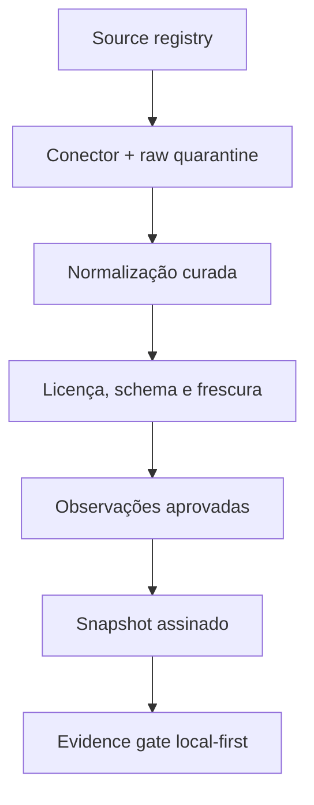

# Market Intelligence Engine

> Estado da implementação: **MI-0 — fundação local concluída em 2026-08-20**.
> Este documento é a especificação executável resumida. O handoff operacional
> vive em [`docs/handoff/MARKET-INTELLIGENCE-HANDOFF.md`](../handoff/MARKET-INTELLIGENCE-HANDOFF.md).

## 1. Resultado que o motor deve produzir

O catálogo de ideias contém hipóteses. O Market Intelligence Engine decide se
há evidência suficiente para as mostrar como oportunidades atuais em Portugal.
Não promete sucesso e não converte texto gerado por IA em factos.

Uma afirmação de mercado só pode entrar num resultado quando guarda:

- entidade publicadora e fonte registada;
- métrica e unidade explícitas;
- geografia e respetiva classificação;
- período de referência;
- data de publicação, quando existe;
- data real de recolha;
- validade para a finalidade concreta;
- transformação e versão do parser;
- estado de qualidade e mapeamento semântico;
- SHA-256 do conteúdo de origem.

Se estes elementos não forem demonstráveis, o estado correto é **dados
insuficientes**, nunca uma média, previsão ou “estimativa plausível” escondida.

## 2. Fronteiras que não se atravessam

| Responsabilidade | Fonte de verdade |
|---|---|
| impostos, Segurança Social, IVA e obrigações legais | motores fiscais existentes |
| preço, margem, horas faturáveis e capacidade económica da oferta | `src/lib/pricing` |
| agregação, estrutura, caixa e viabilidade do negócio | `src/lib/negocio` |
| procura, estrutura setorial, concorrência e proveniência externa | `src/lib/negocio/market` |
| perfil, localização exata e testes privados do utilizador | dispositivo do utilizador |

O módulo de mercado não contém um segundo solver de preço. O `evidence gate`
recebe `economicViability` do motor canónico e apenas decide se essa condição,
em conjunto com a evidência externa, permite subir o estado da hipótese.

## 3. Estados públicos

| Estado | Linguagem da interface | Condição resumida |
|---|---|---|
| `template` | Ideia possível | catálogo sem evidência utilizável |
| `signal_detected` | Sinal a investigar | pelo menos um sinal saudável |
| `candidate` | Candidata para teste | sinais independentes; economia ou operação por validar |
| `evidence_qualified` | Oportunidade sustentada por dados | gate completo atravessado |
| `user_validated` | Validada no seu mercado | orçamento aceite, pré-venda, piloto pago ou venda atual |
| `operating` | Negócio em operação | repetição, contribuição positiva e recebimento observados |
| `stale` | Precisa de nova validação | fonte crítica ou prova do utilizador perdeu validade |
| `contradicted` | Hipótese contrariada | requisito bloqueado, economia inviável ou contradição decisiva |

Um piloto pago isolado sobe para `user_validated`, não para `operating`.

## 4. Evidence gate mínimo

Para `evidence_qualified`, todas estas condições são obrigatórias:

1. sinal recente de procura ou transação;
2. segundo sinal de estrutura, transação, oferta, concorrência ou custo;
3. pelo menos duas fontes independentes e saudáveis;
4. geografia compatível com o modelo de entrega;
5. mapeamento semântico aprovado por curadoria;
6. nenhuma fonte crítica stale, em revisão de licença ou quarentena;
7. viabilidade económica confirmada na Pricing/Business Engine;
8. requisitos críticos conhecidos;
9. teste de falsificação definido.

O score de atratividade só será implementado depois deste gate. Um score alto
não pode compensar licença desconhecida, dado antigo, geografia errada ou um
preço economicamente inviável.

## 5. Quatro relógios diferentes

| Campo | Pergunta que responde |
|---|---|
| `referencePeriod` | a que período o valor diz respeito? |
| `publishedAt` | quando a entidade o publicou/reviu? |
| `retrievedAt` | quando o Recibo Certo o recolheu? |
| `validUntil` | até quando pode sustentar esta finalidade? |

`retrievedAt` nunca prolonga `referencePeriod`. Uma série de 2023 recolhida em
2026 continua a ser uma série de 2023.

## 6. Pipeline pretendida



O browser não deve consultar dez fornecedores quando alguém abre um cartão.
A ingestão ocorre no servidor, publica um pack público compacto e o cliente
combina esse pack localmente com o perfil privado.

## 7. Source registry inicial

Estado revisto em 2026-08-20:

| Fonte | Acesso confirmado | Estado do conector | Estado de reutilização |
|---|---|---|---|
| [INE — API da Base de Dados](https://www.ine.pt/xportal/xmain?xpgid=ine_api_db&xpid=INE) | JSON por indicador | `ready` | `review_required` |
| [BPstat — Data API](https://bpstat.bportugal.pt/data/docs) | API JSON-stat | `planned` | `review_required` |
| [dados.gov.pt](https://dados.gov.pt/) | API/catálogo aberto | `planned` | catálogo aprovado; licença de cada recurso é separada |

### Porque o INE ainda fica em quarentena

A documentação oficial confirma o endpoint e o acesso público. Nesta revisão
não foi encontrada, na própria documentação da API, uma licença inequívoca que
autorize armazenamento e republicação comercial de qualquer série. O conector
funciona, mas `validateMarketObservation()` bloqueia publicação até essa questão
ser resolvida e registada. O mesmo princípio aplica-se ao BPstat.

Isto é uma propriedade do produto, não um atraso acidental: **acesso público não
é sinónimo automático de direito de republicação**.

## 8. Conector INE MI-0

Implementação: `src/lib/negocio/market/connectors/ine.ts`.

O conector:

- constrói apenas URLs para o host e endpoint registados;
- aceita códigos de indicador com exatamente sete algarismos;
- usa `op=2`, língua explícita e `Accept: application/json`;
- valida o envelope antes de o usar;
- calcula SHA-256 da resposta, sem fallback para hash fraco;
- recebe `fetch` e relógio por injeção para testes determinísticos;
- normaliza apenas períodos anuais nesta primeira versão;
- exige unidade, métrica, validade, dimensões e geografias num manifesto curado;
- põe sinais convencionais, valores ambíguos, duplicados e mudanças de nome
  geográfico em quarentena.

O indicador `0000540` presente nos testes é uma fixture do schema oficial. Foi
escolhido porque a resposta pública contém períodos, geografias, dimensões,
valores e sinais convencionais. **Não é uma métrica de oportunidade e não entra
no produto.**

## 9. Integridade e source health

Uma observação só é publicável quando:

- a fonte existe no registry;
- a licença está `approved`;
- campos obrigatórios não estão vazios;
- números são finitos;
- datas ISO são inequívocas e o período é coerente;
- país, código e nome geográfico existem;
- completude pertence a `[0, 1]`;
- mapeamento semântico está `approved`;
- checksum usa SHA-256;
- a observação não expirou.

Estados operacionais reservados no contrato:

`healthy`, `delayed`, `stale`, `schema_changed`, `license_review`,
`quarantined` e `disabled`.

Não existe fallback numérico quando uma fonte falha.

## 10. Privacidade e segurança

- Perfil pessoal, localização precisa, entrevistas, orçamentos e vendas ficam
  locais por omissão.
- Snapshots públicos não contêm consultas individuais nem identificadores de
  utilizadores.
- APIs pagas/on-demand só serão chamadas por ação explícita e segundo os termos
  de cache/armazenamento.
- Não fazer scraping de Google Maps, Idealista, OLX, LinkedIn ou plataformas
  semelhantes.
- IA pode propor um mapeamento CAE/CPV/termo, mas não o aprova nem fornece o
  valor numérico.

## 11. Critérios antes da primeira interface pública

Não criar cartões verdes de “oportunidade” enquanto não existirem:

1. licença resolvida para as séries publicadas;
2. três fontes independentes úteis, sendo pelo menos duas oficiais ou
   transacionais licenciadas;
3. manifests de indicadores curados e versionados;
4. pipeline de ingestão com raw quarantine;
5. snapshot versionado, hash, assinatura e manifesto;
6. source health observável;
7. integração explícita com a Pricing Engine;
8. cartões com fonte, geografia, período, recolha e limitações visíveis.

Até lá, qualquer protótipo visual usa estados `template`/`dados insuficientes`
e nunca valores fictícios apresentados como mercado atual.

## 12. Verificação local

```bash
npm ci
npm run market:check
npx tsc --noEmit
```

O primeiro checkpoint contém 28 testes dedicados a source registry, integridade,
frescura, evidence gate e conector INE.
