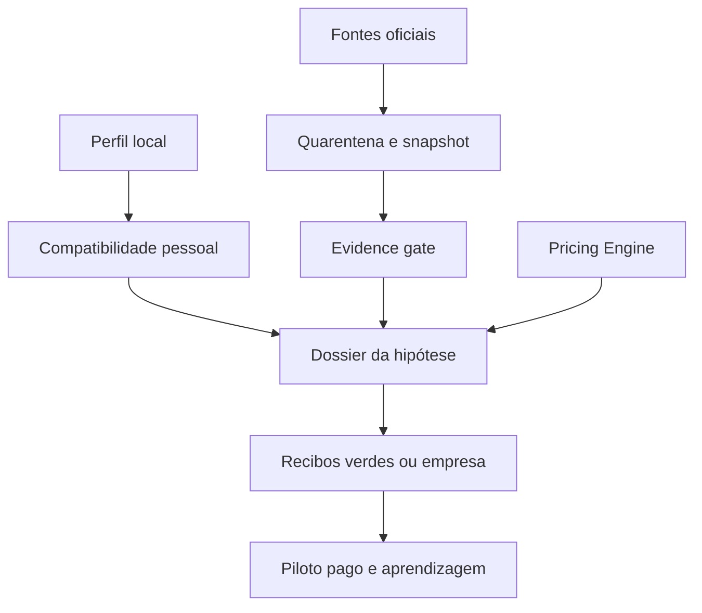

# Relatório mestre — Motor de Negócio Portugal 2026

> Documento de produto, dados e implementação para um motor comum aos
> simuladores de recibos verdes e empresa. Revisão: **20 de agosto de 2026**.
> O código executável vive em `src/lib/negocio/market` e as interfaces em
> `/ferramentas/descobrir-negocio`, `/ferramentas/recibos-verdes` e
> `/dashboard/negocio`.

## 1. Decisão central

O produto não deve ser uma lista de “negócios rentáveis”, nem uma cópia do
Simulador de Empresas. Deve ser um **motor de decisão progressiva** que responde,
por esta ordem, a quatro perguntas diferentes:

1. **Cabe em mim?** Compatibilidade com competências, capital, localização,
   disponibilidade e preferência de receita.
2. **Há um sinal atual?** Observações externas, oficiais ou transacionais,
   datadas e geograficamente compatíveis.
3. **As contas aguentam?** Preço, margem, capacidade e ponto de equilíbrio
   calculados nos motores canónicos do ReciboCerto.
4. **Alguém pagou?** Entrevista não basta: orçamento aceite, pré-venda, piloto
   pago e repetição promovem a hipótese por estados distintos.

Estas dimensões nunca são somadas num “score mágico”. Uma pessoa pode ter 95%
de compatibilidade com uma ideia sem existir procura paga. Um setor pode crescer
e continuar a ser uma péssima escolha para aquela pessoa, geografia ou preço.

## 2. O que foi aproveitado do relatório das 72 oportunidades

O ficheiro `Relatorio_Mestre_72_Oportunidades_AML_2026_MOBILE(1).html` contém uma
boa gramática de investigação:

- clusters e pesquisa;
- problema, cliente e forma de entrega;
- modelo de preço;
- investimento e cenários;
- divisão de papéis;
- primeiros clientes;
- risco, localização e teste de falsificação.

Essas ferramentas foram convertidas em contratos reutilizáveis. Não foram
reutilizados como factos:

- rankings 1–72;
- notas de procura, recorrência ou concorrência;
- investimento exato;
- faturação mensal e cenários financeiros;
- afirmações de “melhor oportunidade”.

O próprio relatório reconhece que esses valores são premissas de comparação,
não previsões. No produto novo, uma premissa permanece identificada como
premissa até uma fonte ou teste do utilizador a substituir.

## 3. Pesquisa atual de Portugal: o que os dados dizem — e não dizem

### 3.1 Tecido empresarial

O INE publicou em 28 de janeiro de 2026 que, em 2024, existiam **1 593 415
empresas ativas** em Portugal e nasceram **246 589 empresas**. Isto sustenta a
existência de um universo empresarial amplo e renovado; não prova, por si só,
procura por consultoria, automação, contabilidade ou qualquer serviço concreto.

Fonte: [INE — Demografia das empresas 2024](https://www.ine.pt/xportal/xmain?DESTAQUESdest_boui=695016291&DESTAQUESmodo=2&xlang=pt&xpgid=ine_destaques&xpid=INE).

### 3.2 Digitalização de empresas

O INE reportou em novembro de 2025 que **11,5% das empresas utilizavam
tecnologias de IA em 2025**, mais 2,9 pontos percentuais do que em 2024. O
relatório europeu Digital Decade 2025 indicava, para o ano de referência 2024,
**74,3% das PME portuguesas com intensidade digital pelo menos básica** e
**8,6% das empresas a usar IA**. As duas medidas têm universos e metodologias
diferentes; não devem ser fundidas numa tendência sem ler a metadata.

Fontes: [INE — Utilização de TIC nas empresas 2025](https://www.ine.pt/xportal/xmain?DESTAQUESdest_boui=707461582&DESTAQUESmodo=2&xpgid=ine_destaques&xpid=INE),
[Comissão Europeia — Digital Decade 2025, Portugal](https://wwwcdn.dges.gov.pt/sites/default/files/digital_decade_2025_country_report_portugal.pdf) e
[Eurostat — metadata do Digital Intensity Index](https://ec.europa.eu/eurostat/cache/metadata/en/isoc_e_dii_esmsip2.htm).

Leitura de produto: existe transformação tecnológica mensurável, mas a adoção
de tecnologia não equivale a compra de um “pacote de digitalização”. O piloto
correto escolhe um processo observável — propostas, pedidos, cobranças ou
agendamento — e mede tempo antes/depois.

### 3.3 Turismo

Em junho de 2026, o Turismo de Portugal reportou **3,1 milhões de hóspedes** e
**8,1 milhões de dormidas** no alojamento turístico, com variações homólogas de
+1,0% e +0,7%. Entre janeiro e junho foram 15,1 milhões de hóspedes e 37 milhões
de dormidas. Grande Lisboa cresceu 2,3% em dormidas nesse mês.

Fonte: [TravelBI — Turismo em Números, junho de 2026](https://travelbi.turismodeportugal.pt/turismo-portugal/turismo-numeros-junho-2026/).

O piloto implementado não copia estes números para o código. Consulta o
indicador oficial do INE `0013314` e publica apenas observações que atravessem
o manifesto de dimensão, geografia, período, checksum, frescura e licença CC BY
4.0 do dataset. O TravelBI é uma segunda superfície de publicação; quando usa a
mesma operação estatística do INE conserva a mesma `independenceKey` e não cria
triangulação artificial.

Verificação operacional em 20 de agosto de 2026: o catálogo do dados.gov.pt
identificava a última atualização em 16 de julho de 2026 e a licença CC BY 4.0;
a API do INE declarava atualização em 9 de julho, último período `2025` e a
dimensão `01 = Hotelaria`. Datas e valores continuam a ser lidos da fonte em
runtime — esta verificação não se transforma num número hardcoded.

### 3.4 Contratação pública

O Portal BASE centraliza contratos públicos e declara disponibilização gratuita
em formatos abertos e API. Isto permite investigar volume de procedimentos,
adjudicações, CPV, geografia e sazonalidade. O valor anunciado de um contrato
não é receita provável de uma pequena empresa e não deve alimentar diretamente
um forecast.

Fontes: [Portal BASE](https://www.base.gov.pt/Base4/pt/o-portal/base/) e
[BASE — portal de contratos](https://www.base.gov.pt/base4).

### 3.5 Trabalho independente e escolha de estrutura

O gov.pt atualizou em 8 de julho de 2026 o serviço de abertura de atividade nas
Finanças e mantém um guia para trabalhadores independentes. A escolha entre
recibos verdes e empresa deve nascer das mesmas premissas económicas e depois
aplicar obrigações distintas; nunca de uma regra universal por faturação.

Fontes: [gov.pt — abrir atividade](https://www.gov.pt/servicos/abrir-atividade-nas-financas),
[guia para trabalhar por conta própria](https://www.gov.pt/guias/trabalhar-por-conta-propria-guia-para-trabalhadores-independentes) e
[gerir o negócio](https://www.gov.pt/guias/gerir-o-negocio).

## 4. Hierarquia de evidência

| Nível | Evidência | O que permite dizer |
|---|---|---|
| 0 | template editorial | “é uma ideia possível” |
| 1 | uma observação publicável | “há um sinal a investigar” |
| 2 | sinal de procura/transação + apoio independente | “é candidata a teste” |
| 3 | nível 2 + preço viável + requisitos + falsificação | “é sustentada por dados” |
| 4 | orçamento aceite, pré-venda, piloto pago ou venda | “foi validada no teu mercado” |
| 5 | repetição + contribuição positiva + recebimento | “está em operação” |

Contradição decisiva, requisito bloqueado ou economia inviável vencem qualquer
score. Prova expirada degrada para `stale`.

## 5. Contrato mínimo de uma observação

Cada número público guarda:

- publisher e `sourceId` registado;
- dataset/série e métrica;
- unidade;
- geografia, código e versão de classificação;
- período de referência;
- publicação, recolha e validade;
- licença aplicável àquela observação;
- transformação e parser versionados;
- qualidade e mapeamento semântico;
- SHA-256 do conteúdo de origem.

Uma licença específica CC BY de um dataset do INE pode aprovar esse dataset sem
aprovar genericamente toda a API do INE. Uma entrada no dados.gov não aprova
automaticamente o recurso: a licença declarada pelo publisher continua a ser
verificada.

## 6. Source registry 2026

| Fonte | Conector | Uso pretendido | Estado jurídico no motor |
|---|---|---|---|
| INE API | pronto | estrutura, conjuntura, operação | fonte genérica em revisão; dataset específico pode ser aprovado |
| Eurostat JSON-stat | pronto | comparação, digitalização, turismo e demografia | reutilização aprovada com atribuição; termos específicos prevalecem |
| dados.gov.pt | catálogo planeado | descoberta de recursos portugueses | catálogo aberto; licença por recurso |
| BPstat | planeado | estrutura setorial, crédito e pagamentos | reutilização/armazenamento por confirmar |
| IEFP ODS mensal | planeado | ofertas por região e CAE | ficheiro acessível; republicação por confirmar |
| BASE/TED | planeado | procedimentos e adjudicações por CPV | manifesto e termos do endpoint ainda por fechar |
| TravelBI | investigação | turismo mensal e municipal | lineage identificada; termos por recurso |

Política de reutilização consultada:
[dados.gov.pt — reutilizar dados](https://dados.gov.pt/recursos/como-usar-o-portal/como-reutilizar-dados),
[termos do dados.gov.pt](https://dados.gov.pt/termos-de-utilizacao) e
[Eurostat — copyright/reuse](https://ec.europa.eu/eurostat/help/copyright-notice).

## 7. O motor comum

O núcleo é agnóstico à estrutura. A mesma hipótese, oferta, custos, tempo,
volume e preço seguem para duas superfícies:

- **recibos verdes:** IRS, Segurança Social, retenção, IVA e líquido pessoal;
- **empresa:** custos de estrutura, IRC, remuneração/dividendos, caixa e
  capacidade organizacional.

A interface muda; as fórmulas-base não são duplicadas.

## 8. Ferramentas do produto

### 8.1 Descobrir que negócio testar

Implementado em `/ferramentas/descobrir-negocio`:

- pergunta forma de entrega, zona, capital, recorrência, estrutura e competências;
- calcula apenas compatibilidade pessoal;
- mostra cinco dossiers-piloto;
- consulta o endpoint oficial no servidor, com cache de seis horas;
- não envia o perfil para a API;
- mostra fonte, geografia, período e momento da consulta;
- expõe o que falta para qualificar;
- abre diretamente o cenário certo do Pricing Engine nos recibos verdes;
- leva a mesma hipótese para o estúdio de empresa, sem apagar o projeto que já
  exista nem duplicar a oferta ao atualizar a página.

Pilotos atuais:

1. operações locais para alojamento turístico;
2. operações digitais para microempresas;
3. acompanhamento digital para seniores/famílias;
4. radar operacional de concursos públicos;
5. coordenação de transições de casa.

Só o primeiro tem ingestão pública ativa neste checkpoint. Os restantes estão
deliberadamente em `template` até os manifests e licenças atravessarem o gate.

### 8.2 Formar preço dentro dos recibos verdes

Implementado em `/ferramentas/recibos-verdes`:

- “Já sei quanto vou faturar” conserva o simulador existente;
- “Ainda não sei quanto cobrar” incorpora o mesmo `SimuladorPreco` das
  empresas;
- a conclusão passa `precoLiquido` e a projeção anual para o simulador fiscal;
- a base é sem IVA, coerente com o contrato do simulador;
- não há iframe, fork ou cópia do solver;
- URL e armazenamento continuam pertencentes à superfície que incorpora.

### 8.3 Handoff atual para o motor de empresa

O CTA de empresa usa apenas o identificador público da oportunidade. O servidor
resolve esse identificador contra o catálogo curado e entrega ao
`NegocioStudio` o nome e o cenário canónico de preço. No cliente:

- um projeto reaberto ou rascunho existente é conservado;
- a hipótese entra como uma nova oferta e abre na Pricing Engine;
- cenário + nome tornam a operação idempotente, impedindo duplicados em reload;
- nenhum custo, preço ou faturação editorial é pré-preenchido como se fosse
  dado do utilizador.

Este é o primeiro elo comum. A transferência bidirecional de um cenário de
preço já concluído e a comparação fiscal sem repetir qualquer input continuam
no roadmap.

### 8.4 Dossier futuro de oportunidade

O dossier completo deve acrescentar, sem esconder o estado atual:

- mapa de procura e raio executável;
- concorrência observada e substitutos;
- requisitos e seguros;
- oferta mínima e limites;
- preço mínimo/recomendado e capacidade;
- canal de aquisição e custo medido;
- entrevista, orçamento, piloto e vendas;
- log de hipóteses contrariadas;
- comparação recibos verdes/empresa com as mesmas premissas;
- data da próxima revalidação.

## 9. Modelo económico e preço

O adapter `pricing-market-adapter@1` não recalcula preço. Recebe
`ResultadoPreco` e verifica quatro saídas:

1. o motor encontrou solução;
2. contribuição unitária positiva;
3. lucro operacional unitário positivo;
4. break-even possível.

Sem cenário concluído, `economicViability = null`. Isto impede a engine de
qualificar genericamente uma ideia com custos que pertencem à realidade do
utilizador.

O preço de mercado não é substituído por custo + margem. O fluxo correto é:

- calcular o piso económico;
- recolher preços observados apenas quando a licença permite;
- testar disposição a pagar com orçamento/piloto;
- comparar preço aceite com o piso;
- rever segmento, pacote, canal ou estrutura quando não existe interseção.

## 10. Privacidade, segurança e resiliência

- Perfil, localização exata, entrevistas, clientes e valores privados ficam no
  dispositivo por omissão.
- O browser pede apenas um pack público agregado; não consulta fornecedores
  externos com o perfil da pessoa.
- Falha de fonte produz `delayed`, `quarantined` ou `stale`; nunca um número de
  fallback.
- Raw data é validado antes de publicação.
- Snapshots usam canonicalização, SHA-256 e HMAC-SHA256; a chave vive apenas no
  servidor/CI.
- O snapshot anterior só pode continuar enquanto válido.
- Google Maps, Idealista, OLX, LinkedIn e outras plataformas não são raspados.
- IA pode sugerir mapeamentos; aprovação semântica continua humana.

## 11. Design e linguagem

O produto segue `DESIGN.md`:

- verde humano, neutros quentes, Playfair + DM Sans;
- cartões `rounded-4xl`, sombras contidas e dark mode;
- divulgação progressiva;
- números com fonte e data;
- alvos de toque, foco visível e semântica de acordeão;
- linguagem “sinal”, “hipótese”, “falta provar”, não “negócio garantido”.

Na lista, a percentagem é sempre “compatibilidade contigo”. O estado de dados
é um badge independente. Esta separação visual é uma salvaguarda epistemológica,
não apenas estética.

Mockups conceptuais produzidos com estes padrões (o código da interface é a
fonte de verdade):

- [Motor de descoberta — desktop](../images/motor-negocio-conceito-desktop.png)
- [Preço dentro dos recibos verdes — mobile](../images/preco-recibos-verdes-conceito-mobile.png)

## 12. Métricas de produto

Não otimizar cliques no cartão. Medir uma escada de decisão:

- dossier aberto;
- cenário de preço iniciado;
- essenciais do preço concluídos;
- hipótese guardada localmente;
- entrevista registada;
- orçamento enviado/aceite;
- piloto pago;
- repetição;
- contribuição positiva observada;
- revalidação concluída antes de expirar.

Métricas de confiança:

- percentagem de cartões com observações publicáveis;
- idade mediana do período de referência;
- fontes delayed/stale/quarantined;
- alterações de schema detetadas antes de chegar à interface;
- falsas triangulações impedidas por lineage;
- hipóteses abandonadas por falsificação (resultado saudável, não falha).

## 13. Monetização sem degradar a confiança

O núcleo deve continuar gratuito e sem conta:

- descobrir, ler fontes, calcular preço e comparar estrutura;
- exportação avançada, histórico de versões e packs de validação podem ser Plus;
- handoff voluntário para contabilista ou especialista pode gerar receita;
- dados pagos/on-demand só por ação explícita e com custo mostrado;
- nunca vender melhor posição num ranking de oportunidades.

## 14. Roadmap sem “big bang”

### Checkpoint atual — MI-1

- contratos, registry e evidence gate;
- lineage independente;
- conectores INE e Eurostat;
- licença específica por dataset;
- quarentena, source health e snapshot assinado;
- adapter canónico de preço;
- cinco pilotos e compatibilidade pessoal;
- ingestão pública do piloto turístico;
- rota de descoberta;
- preço incorporado nos recibos verdes.
- handoff não destrutivo da hipótese para o estúdio de empresa.

### MI-2 — prova comercial e localização

- guardar hipótese localmente;
- entrevistas e cartões de aprendizagem;
- orçamento/piloto pago e mudança de estado;
- localização por NUTS/município sem guardar morada;
- manifests Digital Intensity, competências digitais e BASE/TED;
- snapshot publicado atomicamente por job;
- painel de source health.

### MI-3 — motor comum de execução

- transferir preços e custos já confirmados nos dois sentidos;
- comparar recibos/empresa sem repetir inputs;
- capacidade, caixa e contratação;
- revalidação programada;
- export/handoff profissional;
- cohort de resultados reais, apenas com consentimento e agregação.

## 15. Critério de sucesso

O motor é bem-sucedido quando ajuda alguém a matar cedo uma hipótese fraca,
formar um preço que não destrói margem, conseguir um primeiro pagamento e
escolher a estrutura com as mesmas premissas. Não quando consegue produzir uma
lista maior ou um score mais confiante.
